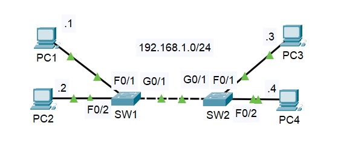

# Ethernet Switching, ARP & the MAC Address Table

**Date:** 2026-05-18 | **Course:** Jeremy's IT Lab – CCNA (Day 5 & 6) | **Simulator:** Cisco Packet Tracer

---

## What This Lab Covers

How switches actually learn which device lives on which port, how ARP resolves an IP address to a MAC address before any real traffic can flow, and what happens at every layer when PC1 pings PC3 for the very first time.

---

## Topology

```
PC1 (.1) ──── SW1 (F0/1) ── G0/1 ── G0/1 ── SW2 (F0/1) ──── PC3 (.3)
PC2 (.2) ──── SW1 (F0/2)                    SW2 (F0/2) ──── PC4 (.4)

Network: 192.168.1.0/24
```



Two switches daisy-chained via their Gigabit uplink ports, with two PCs hanging off each switch.

---

## Background — How Ethernet Switching Works

### The Ethernet Frame

Before anything travels across the wire, it gets wrapped in an Ethernet frame. Every frame has the same structure:

| Field                       | Size          | Bit Pattern                     | Purpose                                              |
| --------------------------- | ------------- | ------------------------------- | ---------------------------------------------------- |
| Preamble                    | 7 bytes       | `10101010` × 7                  | Synchronises the receiver's clock                    |
| SFD (Start Frame Delimiter) | 1 byte        | `10101011`                      | The final `11` signals "frame starts now"            |
| Destination MAC             | 6 bytes       | —                               | Where this frame is going                            |
| Source MAC                  | 6 bytes       | —                               | Where it came from                                   |
| Type/EtherType              | 2 bytes       | `0x0800` = IPv4, `0x0806` = ARP | What's inside the payload                            |
| Data (payload)              | 46–1500 bytes | —                               | The actual content                                   |
| FCS (Frame Check Sequence)  | 4 bytes       | CRC checksum                    | Error detection — frame dropped silently if mismatch |

> Note: The Preamble and SFD operate at the physical layer and are not considered part of the Ethernet frame itself by most definitions. The actual frame begins at the Destination MAC field.

The minimum frame size is **64 bytes**. If the data payload is smaller than 46 bytes, **padding bytes** are added to meet the minimum. This exists because of how collision detection (CSMA/CD) works on older half-duplex links.

The FCS uses a **CRC (Cyclic Redundancy Check)** algorithm — the sender computes a checksum of the frame, embeds it in the FCS field, and the receiver recomputes it on arrival. If the values don't match, the frame is silently dropped.

### The MAC Address

A MAC (Media Access Control) address is a 6-byte (48-bit) hardware identifier assigned to every network interface. It is also called the **BIA — Burned-In Address** because it is permanently written into the NIC by the manufacturer at the factory. Unlike IP addresses, you don't assign MACs — they come with the hardware.

A MAC address is split into two halves:

| Half          | Size    | Name                                     | What it identifies                                   |
| ------------- | ------- | ---------------------------------------- | ---------------------------------------------------- |
| First 3 bytes | 24 bits | OUI (Organizationally Unique Identifier) | The manufacturer (e.g. Cisco, Intel, Dell)           |
| Last 3 bytes  | 24 bits | Device ID                                | The specific interface, assigned by the manufacturer |

For example, in `00D0.D3AD.9CAB` — `00D0.D3` is the OUI (Cisco), and `AD.9CAB` is the unique device portion.

### How a Switch Builds Its MAC Address Table

A switch is fundamentally a learning device. The rule is simple but easy to get backwards:

> **A switch learns from the SOURCE MAC address of incoming frames — not the destination.**

When a frame arrives on a port, the switch records: _"this MAC address lives on this port."_ That entry goes into the MAC address table (also called the CAM table). Over time, the switch builds a complete map of which MAC is reachable via which port.

For forwarding decisions, the switch looks at the **destination MAC**:

- **Known unicast** — destination MAC is in the table → forward out the specific port only
- **Unknown unicast** — destination MAC is not in the table → flood out all ports except the one it arrived on
- **Broadcast** (FFFF.FFFF.FFFF) — always flood out all ports except the source port

### ARP — Resolving IP to MAC

IP addresses are logical. MAC addresses are physical. Before PC1 can send a frame to PC3, it needs PC3's MAC address. That's ARP's job.

**ARP Request** — broadcast, sent to FFFF.FFFF.FFFF:

> _"Who has 192.168.1.3? Tell 192.168.1.1"_

Every device on the subnet receives this. Only PC3 responds.

**ARP Reply** — unicast, sent directly back to PC1:

> _"192.168.1.3 is at 0004.9A6E.D870"_

PC1 stores this mapping in its **ARP table (ARP cache)**. It won't need to ask again until the entry expires.

### ICMP — The Ping

Once ARP is resolved, the actual ping travels as **ICMP Echo Request** (type 8) and **ICMP Echo Reply** (type 0). ICMP is a Layer 3 protocol — it rides inside an IP packet, which rides inside an Ethernet frame. By the time the first ping goes out, ARP has already done its job.

---

## Lab Walkthrough

### Step 1 — What happens when PC1 pings PC3 for the first time?

Both ARP tables and MAC tables are empty. Here's the exact sequence:

**1. PC1 needs PC3's MAC → sends ARP broadcast**

- Ethernet frame: Dest = `FFFF.FFFF.FFFF`, Src = `00D0.D3AD.9CAB`
- EtherType: `0x0806` (ARP)
- ARP payload: _"Who has 192.168.1.3?"_

SW1 receives this on F0/1. It learns PC1's MAC on F0/1. It floods to F0/2 and G0/1 (broadcast).

SW2 receives it on G0/1. Learns PC1's MAC on G0/1. Floods to F0/1 and F0/2.

PC3 and PC4 both receive it. Only PC3 responds.

**2. PC3 sends ARP Reply — unicast back to PC1**

- SW2 learns PC3's MAC on F0/1
- SW2 looks up PC1's MAC → already in table → forwards only to G0/1
- SW1 looks up PC1's MAC → already learned → forwards only to F0/1

**3. PC1 now has PC3's MAC → sends ICMP Echo Request**

- This time it's a known unicast all the way — no flooding needed

### Step 2 — Packet Tracer Simulation Mode Verification

The outbound PDU from PC1 confirms everything above:

**Ethernet header:**

- Destination: `FFFF.FFFF.FFFF` (broadcast — PC3's MAC is unknown)
- Source: `00D0.D3AD.9CAB` (PC1's MAC)
- EtherType: `0x0806` (ARP)

**ARP payload:**

- Hardware type: `0x0001` (Ethernet), Protocol type: `0x0800` (IPv4)
- HLEN: `0x06` (6-byte MAC), PLEN: `0x04` (4-byte IP)
- Opcode: `0x0001` (Request)
- Source MAC: `00D0.D3AD.9CAB`, Source IP: `192.168.1.1`
- Target MAC: `0000.0000.0000` (unknown — that's what we're asking for)
- Target IP: `192.168.1.3`

At PC3, the OSI model view shows what happens next — the ARP process replies with its own MAC, encapsulates the reply into an Ethernet frame, and sends it back unicast to PC1.

### Step 3 — Generating Traffic to Fill the MAC Tables

After sending pings between all four PCs, both switches have learned every MAC address on the network.

### Step 4 — Viewing the MAC Address Tables

**SW1:**

```
SW1# show mac address-table

Vlan    Mac Address       Type      Ports
----    -----------       ----      -----
   1    0001.647b.3119    DYNAMIC   Gig0/1   ← PC4 (via SW2)
   1    0004.9a6e.d870    DYNAMIC   Gig0/1   ← PC3 (via SW2)
   1    0060.5c56.14d3    DYNAMIC   Fa0/2    ← PC2
   1    00d0.d3ad.9cab    DYNAMIC   Fa0/1    ← PC1
```

Notice PC3 and PC4 both point to `Gig0/1` — SW1 can only see them through the uplink to SW2. It doesn't know which specific port they're on over there, and it doesn't need to.

**SW2:**

```
SW2# show mac address-table

Vlan    Mac Address       Type      Ports
----    -----------       ----      -----
   1    0001.647b.3119    DYNAMIC   Fa0/2    ← PC4
   1    0004.9a6e.d870    DYNAMIC   Fa0/1    ← PC3
   1    0060.5c56.14d3    DYNAMIC   Gig0/1   ← PC2 (via SW1)
   1    00d0.d3ad.9cab    DYNAMIC   Gig0/1   ← PC1 (via SW1)
```

Mirror image — PC1 and PC2 are both reachable via `Gig0/1` from SW2's perspective.

All entries are `DYNAMIC` — learned automatically. A dynamic entry is removed if no frame is received from that MAC address for **5 minutes** (the default aging timer on Cisco switches). After that, the switch treats the destination as unknown again and will flood until it relearns. Static entries can be configured manually and never age out.

### Step 5 — Clearing the MAC Address Table

```bash
SW1# clear mac address-table dynamic
SW1# show mac address-table
                                        ← empty — all dynamic entries removed
```

`clear mac address-table dynamic` removes only learned entries. The switch relearns everything the next time traffic flows.

---

## Lab Output — Screenshots

**Outbound ARP PDU from PC1 — Ethernet frame and ARP fields:**


**PC3 OSI model view — ARP request received, unicast reply sent:**


**SW1 — MAC address table populated, then cleared:**


**SW2 — Mirror perspective from the other switch:**


---

## Key Gotcha

> **The switch learns from source MAC, not destination.** When SW1 receives the ARP broadcast from PC1, it floods because `FFFF.FFFF.FFFF` is a broadcast — but as a side effect, it silently records PC1's MAC on F0/1. By the time PC3 sends the unicast ARP reply back, SW1 already knows exactly where to deliver it. The table builds itself through normal traffic, not active discovery.

---

## Summary

| Concept            | Key Point                                                                     |
| ------------------ | ----------------------------------------------------------------------------- |
| MAC address / BIA  | Burned-In Address — 6 bytes, hardcoded by manufacturer into the NIC           |
| OUI                | First 3 bytes of MAC — identifies the manufacturer                            |
| Device ID          | Last 3 bytes of MAC — unique to the specific interface                        |
| MAC table learning | Source MAC of incoming frame → recorded against incoming port                 |
| Known unicast      | Destination in table → forward to that port only                              |
| Unknown unicast    | Destination not in table → flood all ports except source                      |
| Broadcast          | Always flooded to all ports except source                                     |
| Dynamic MAC aging  | Entry removed after 5 minutes of inactivity — switch relearns on next traffic |
| ARP request        | Broadcast — asks "who has this IP?"                                           |
| ARP reply          | Unicast — answers with the MAC address                                        |
| ICMP ping          | Only sent after ARP resolves the MAC                                          |
| Minimum frame size | 64 bytes — padding added if data payload < 46 bytes                           |
| Preamble           | `10101010` × 7 bytes — clock sync at physical layer                           |
| SFD                | `10101011` — the `11` marks the start of the actual frame                     |
| FCS / CRC          | Frame silently dropped if checksum doesn't match                              |

**Commands used:**

| Command                           | What it does                         |
| --------------------------------- | ------------------------------------ |
| `show mac address-table`          | View all current MAC table entries   |
| `clear mac address-table dynamic` | Wipe all dynamically learned entries |

---

_Part of my CCNA self-study journey following Jeremy's IT Lab. Labs documented for practical reinforcement and portfolio._
