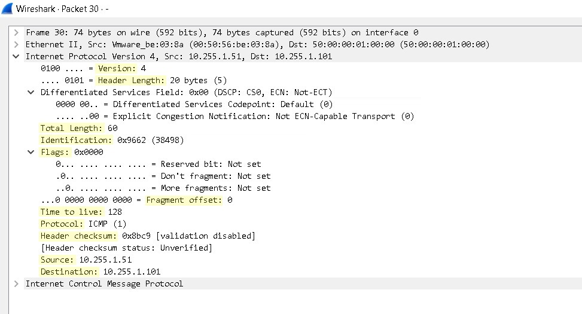

# Day 10 — The IPv4 Header

**Date:** 2026-05-24 | **Module:** Network Fundamentals  
**Source:** Jeremy's IT Lab

> No lab was done for this chapter. This README is based entirely on the theory. The header fields become more meaningful in context — the TTL field in particular connects directly to what was observed in [Day 11](../Static%20Routing/README.md), where a TTL of 125 confirmed the packet crossed exactly 3 router hops.

---

## What is the IPv4 Header?

Every IPv4 packet begins with a header — a structured block of fields that carries all the information a router or receiving device needs to handle that packet correctly. The header is separate from the actual data (payload) being carried.

- Size ranges from **20 to 60 bytes**
- The minimum 20 bytes covers the fixed fields that are always present
- The additional 40 bytes are only used when the Options field is included
- The header wraps around a Layer 4 PDU — either a TCP Segment or a UDP Datagram

---

## IPv4 Header Fields — Overview

| Field               | Size (bits) | Purpose                                                  |
| ------------------- | ----------- | -------------------------------------------------------- |
| Version             | 4           | Identifies IP version in use                             |
| IHL                 | 4           | Marks where the header ends and data begins              |
| DSCP                | 6           | Classifies and prioritizes traffic (QoS)                 |
| ECN                 | 2           | Signals network congestion without dropping packets      |
| Total Length        | 16          | Total size of the packet — header plus data              |
| Identification      | 16          | Groups fragments that belong to the same original packet |
| Flags               | 3           | Controls and tracks packet fragmentation                 |
| Fragment Offset     | 13          | Position of a fragment within the original packet        |
| TTL                 | 8           | Hop counter — prevents packets from looping forever      |
| Protocol            | 8           | Identifies the Layer 4 protocol carried in the payload   |
| Header Checksum     | 16          | Error detection for the header only                      |
| Source Address      | 32          | IPv4 address of the sender                               |
| Destination Address | 32          | IPv4 address of the intended recipient                   |
| Options             | 0–320       | Optional extended functionality beyond the fixed header  |

Different fields of IPv4 header in an ICMP packet.

---

## Field Descriptions

### Version

- 4-bit field
- Tells the receiving device which version of IP is being used
- IPv4 = `0100` in binary (decimal 4)
- IPv6 = `0110` in binary (decimal 6)
- A device that receives a packet checks this field first to know how to read everything that follows

---

### IHL — Internet Header Length

- 4-bit field
- Indicates where the header ends and the payload begins
- The value is measured in **4-byte increments**, not raw bytes
- Minimum value is **5** → 5 × 4 = **20 bytes** (no Options field present)
- Maximum value is **15** → 15 × 4 = **60 bytes** (Options field fully used)
- When IHL is exactly 5, there are no options and the data starts immediately after the 20-byte fixed header

---

### DSCP — Differentiated Services Code Point

- 6-bit field
- Used for **Quality of Service (QoS)** — classifying and prioritizing different types of traffic
- A router can use the DSCP value to decide which packets get forwarded first
- Common use case: voice and video traffic is marked with a higher priority so it is not delayed by bulk file transfers

---

### ECN — Explicit Congestion Notification

- 2-bit field
- Allows a router experiencing congestion to notify the sender **without dropping the packet**
- Traditionally, congestion was signalled by simply dropping packets — the sender would notice the loss and slow down
- ECN provides a cleaner signal: the router marks the packet, the receiver echoes the signal back to the sender, and the sender reduces its transmission rate
- Both endpoints must support ECN for it to work — if either side does not support it, the field is ignored

> DSCP and ECN together occupy what was previously the single 8-bit ToS field in older IPv4 implementations.

---

### Total Length

- 16-bit field
- Indicates the **total size of the entire packet** — IPv4 header plus the Layer 4 payload
- Minimum value: 20 bytes (header only, no data)
- Maximum value: 65,535 bytes (2¹⁶ − 1)
- The receiving device uses this to know exactly how many bytes to read for this packet

---

### Identification

- 16-bit field
- When a large packet is broken into fragments to cross a network that cannot handle its size, every fragment carries the same Identification value
- This allows the receiving device to collect all the pieces and reassemble them into the original packet
- Each new original packet gets a unique Identification value

It confused me while i was reading this section of fragmentation, i did not understand fully at first. Later discovered it and made a summary out of it:

### Packet Fragmentation vs Data Segmentation

| Feature         | Data Segmentation                   | Packet Fragmentation                                 |
| --------------- | ----------------------------------- | ---------------------------------------------------- |
| Layer           | Layer 4 (TCP)                       | Layer 3 (IPv4)                                       |
| Breaks          | Application Data                    | IP Packet                                            |
| Result          | TCP Segments                        | IP Fragments                                         |
| Based On        | MSS (Maximum Segment Size)          | MTU (Maximum Transmission Unit)                      |
| Decision Made   | Before transmission                 | After packet reception / before forwarding           |
| Performed By    | Sending Host                        | Sending Host or Router                               |
| Purpose         | Make data suitable for transmission | Make packet fit the outgoing link MTU                |
| Reassembly      | By TCP at destination               | By IP at destination                                 |
| Header Used     | TCP Header (Sequence Number)        | IP Header (Identification, Fragment Offset, MF Flag) |
| Preferred Today | Yes (Normal Operation)              | Generally Avoided (PMTUD Preferred)                  |

- **Segmentation:** Breaking a large chunk of application data into smaller TCP segments based on MSS.
- **Fragmentation:** Breaking a large IP packet into smaller IP fragments based on the outgoing interface MTU.

---

### Flags

- 3-bit field
- Controls how fragmentation is handled

| Bit   | Name                | Meaning                                                                                                                                   |
| ----- | ------------------- | ----------------------------------------------------------------------------------------------------------------------------------------- |
| Bit 0 | Reserved            | Always 0, not used                                                                                                                        |
| Bit 1 | DF — Don't Fragment | If set to 1, the packet must not be fragmented. If it is too large for a link, it is dropped and an ICMP error is sent back to the sender |
| Bit 2 | MF — More Fragments | Set to 1 on every fragment except the last one. The receiving device uses this to know when all fragments have arrived                    |

---

### Fragment Offset

- 13-bit field
- Specifies the **position of this fragment** within the original unfragmented packet
- Measured in 8-byte units
- The first fragment always has an offset of 0
- The receiving device uses the offsets to place each fragment in the correct position before reassembly

---

### TTL — Time To Live

- 8-bit field
- Acts as a **hop counter** — every router that forwards the packet decrements this value by 1
- When TTL reaches 0, the router drops the packet and sends an ICMP Time Exceeded message back to the source
- This prevents packets from circulating forever in the event of a routing loop
- Maximum value is 255. Common defaults: Windows = 128, Linux = 64, Cisco devices = 255

This field was observed directly in the [Day 11 lab](../Static%20Routing/README.md). PC1's ping to PC2 returned TTL 125 — starting from Windows default of 128 and decrementing once at R1, R2, and R3, confirming exactly 3 hops.

---

### Protocol

- 8-bit field
- Tells the receiving device which **Layer 4 protocol** is carried inside the packet, so it knows how to handle the payload after stripping the IP header

| Value | Protocol |
| ----- | -------- |
| 1     | ICMP     |
| 6     | TCP      |
| 17    | UDP      |
| 89    | OSPF     |

This connects to what was covered in [Day 01](../TCP_IP%20Model/README.md) — the Protocol field is what makes same-layer interaction work. The IP layer on the receiving side reads this field and hands the payload up to the correct Layer 4 protocol.

---

### Header Checksum

- 16-bit field
- Used for **error detection on the header only** — not the payload
- The sender calculates a checksum value based on the header fields and places it here
- Every router that receives the packet recalculates the checksum and compares it to this field
- If they do not match, the packet is silently dropped
- The payload (TCP or UDP) has its own separate checksum for data integrity

---

### Source Address

- 32-bit field
- The IPv4 address of the device that sent the packet
- Stays the same for the entire journey from source to destination
- Routers do not change this field.

---

### Destination Address

- 32-bit field
- The IPv4 address of the intended recipient
- Every router along the path checks this field to make a forwarding decision
- Also stays the same end-to-end
- Together with Source Address, these two 32-bit fields account for 8 of the 20 fixed header bytes

---

### Options

- Variable length: 0 to 320 bits (0 to 40 bytes)
- Only present when IHL is greater than 5
- Rarely used in modern networks
- Provides additional functionality such as recording the route a packet took, specifying a strict or loose source route, or adding timestamps
- When Options are present, the header length increases and routers may process the packet more slowly since it deviates from the standard fixed structure

---

## What I didn't fully understand

- [ ] Fragmentation in practice — how exactly a packet gets split at a router and reassembled at the destination, and what happens if one fragment is lost
- [ ] ECN mechanics — the surface explanation makes sense but the actual handshake between sender, router, and receiver is not fully clear yet
- [ ] How the Header Checksum is calculated — know what it does but not how the value is computed

---

## Key Takeaways

- The IPv4 header is always at least 20 bytes. Those 20 bytes contain 13 fixed fields that every IP packet carries regardless of what data is inside.
- TTL is the field that prevents routing loops from running forever — and it is also a useful diagnostic tool. Reading TTL in a ping reply reveals exactly how many hops the packet crossed.
- The Protocol field is what allows the IP layer to hand the payload to the right Layer 4 protocol after decapsulation. It is a direct example of adjacent layer interaction.
- Fragmentation fields — Identification, Flags, and Fragment Offset — only matter when a packet is too large for a link. In modern networks fragmentation is avoided where possible, which is why the DF bit exists.
- DSCP and ECN occupy what was previously a single ToS byte. Understanding DSCP becomes more relevant when QoS is covered later in the course.
