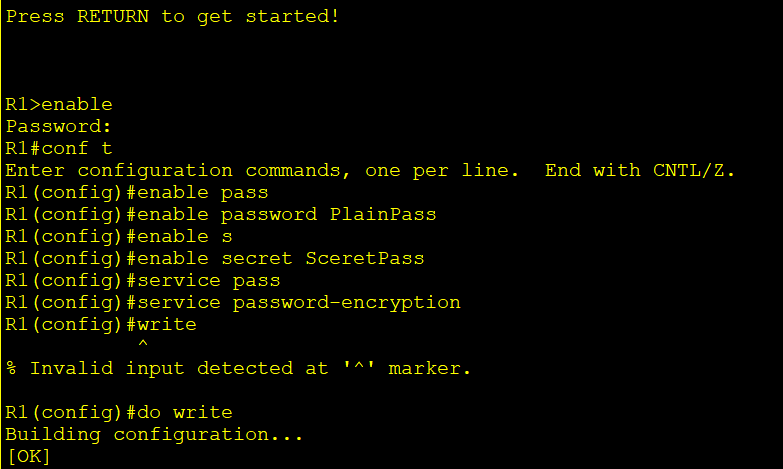
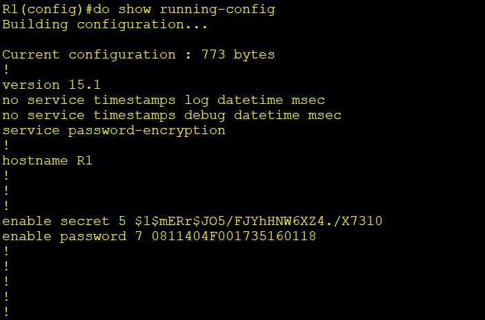
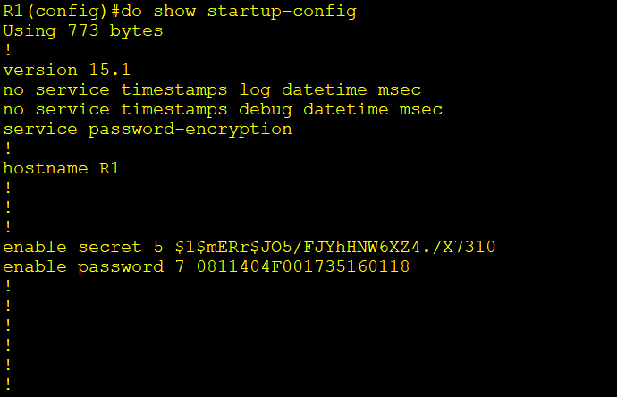

# Lab 02 — Intro to CLI & Basic Device Security

**Date:** 2026-05-13 | **Module:** Network Fundamentals | **Simulator:** Cisco Packet Tracer

---

## What This Lab Covers

Getting hands-on with the Cisco CLI for the first time — navigating between exec modes, setting passwords, understanding how encryption works, and making sure configurations survive a reboot.

---

## Topology

```
R1 ──── SW1 ──┬── PC1
               ├── PC2
               └── PC3
```

A single router (R1) connected to a switch (SW1), which connects three end hosts. Simple setup — the focus here is on the devices themselves, not the network design.

---

## Background — The Cisco CLI

Cisco routers and switches don't have a screen or desktop. You talk to them through a **CLI (Command Line Interface)** running on **Cisco IOS** — accessed via the console port, SSH, or Telnet using a terminal emulator like PuTTY.

### The Three Exec Modes

The CLI is hierarchical. You move up to get more access, and `exit` takes you back down.

| Mode            | Prompt            | What You Can Do                 |
| --------------- | ----------------- | ------------------------------- |
| User EXEC       | `Router>`         | Basic monitoring only           |
| Privileged EXEC | `Router#`         | Full view access, exec commands |
| Global Config   | `Router(config)#` | Change device-wide settings     |

```
Router>           ← User EXEC (entry point)
Router> enable
Router#           ← Privileged EXEC
Router# conf t
Router(config)#   ← Global Configuration
```

> `exit` drops you one level down. `end` or `Ctrl+Z` jumps straight back to Privileged EXEC from anywhere.

---

## Key Concepts

### Enable Password vs Enable Secret

Both restrict access to Privileged EXEC mode, but they're not equal:

- `enable password` — stored in **plain text** in the config file. Anyone who reads the config can see it.
- `enable secret` — hashed with **MD5** (Type 5). Not reversible. Always use this.
- If both are set, **`enable secret` wins** — the password is ignored.

### Service Password-Encryption

Running `service password-encryption` applies **Type 7 encryption** to plain-text passwords in the config (like `enable password` and line passwords). It's better than nothing, but Type 7 is a weak proprietary cipher — freely available decryptors exist online. It's a deterrent, not real security.

**The hierarchy in practice:**

```
enable password  →  plain text (weakest)
+ service password-encryption  →  Type 7 (weak, reversible)
enable secret  →  MD5 hash (strong, use this)
```

### Running Config vs Startup Config

|                      | Running Config              | Startup Config        |
| -------------------- | --------------------------- | --------------------- |
| **Stored in**        | RAM                         | NVRAM                 |
| **Active?**          | Yes — right now             | Only at boot          |
| **Survives reboot?** | No                          | Yes                   |
| **View**             | `show run`                  | `show startup-config` |
| **Save**             | `copy run start` or `write` | —                     |

Changes you make are live immediately but **lost on reboot** unless you save them. Always save before powering off.

---

## Lab Walkthrough

### Step 1 — Set Hostnames

```bash
Router> enable
Router# conf t
Router(config)# hostname R1
R1(config)#

Switch> enable
Switch# conf t
Switch(config)# hostname SW1
SW1(config)#
```

The prompt changes immediately to confirm the hostname is set.

### Step 2 — Set an Unencrypted Enable Password

```bash
R1(config)# enable password CCNA
SW1(config)# enable password CCNA
```

### Step 3 — Test the Password

```bash
R1(config)# exit
R1# exit
R1> enable
Password: CCNA      ← typed but not shown on screen
R1#
```

### Step 4 — View the Password in Running Config

```bash
R1# show running-config
...
enable password CCNA     ← visible in plain text
```

### Step 5 — Encrypt All Current and Future Passwords

```bash
R1(config)# service password-encryption
```

### Step 6 — View Running Config Again

```bash
R1# show running-config
...
enable password 7 082D495808     ← now Type 7 encrypted
```

The `7` indicates the encryption type. The password is now obfuscated, though not truly secure.

### Step 7 — Set a Stronger Encrypted Password

```bash
R1(config)# enable secret Cisco
SW1(config)# enable secret Cisco
```

### Step 8 — Test Which Password Is Active

```bash
R1(config)# exit
R1# exit
R1> enable
Password: Cisco     ← enable secret takes priority
R1#
```

When both `enable password` and `enable secret` are configured, **`enable secret` always overrides**. The `enable password` is effectively ignored.

### Step 9 — View Both Passwords in Running Config

```bash
R1# show running-config
...
enable secret 5 $1$mERr$JO5/FJYhHNW6XZ4./X7310
enable password 7 0811404F001735160118
```

- **Type 7** — `enable password` after `service password-encryption`. Weak, reversible.
- **Type 5** — `enable secret`. MD5 hash. Strong, not reversible.

### Step 10 — Save the Configuration

```bash
R1# copy running-config startup-config
Destination filename [startup-config]?   ← press Enter
Building configuration...
[OK]

# Shorthand:
R1# write
```

Config is now saved to NVRAM and will persist after a reboot.

---

## Lab Output — Screenshots

**CLI commands executed (password setup):**



**Running config — passwords shown with encryption types:**



**Startup config — confirms save was successful:**



---

## Summary

| Task                         | Command                       |
| ---------------------------- | ----------------------------- |
| Enter privileged mode        | `enable`                      |
| Enter global config          | `conf t`                      |
| Set hostname                 | `hostname <name>`             |
| Set plain-text password      | `enable password <pass>`      |
| Set secure password          | `enable secret <pass>`        |
| Encrypt plain-text passwords | `service password-encryption` |
| View active config           | `show running-config`         |
| View saved config            | `show startup-config`         |
| Save config                  | `copy run start` or `write`   |

**Key takeaway:** Always use `enable secret` over `enable password`. `service password-encryption` is a weak safeguard — it helps against shoulder-surfing but not against determined attackers. Save your config — RAM doesn't survive a reboot.

---

_Part of my CCNA self-study journey following Jeremy's IT Lab. Labs documented for practical reinforcement and portfolio._
