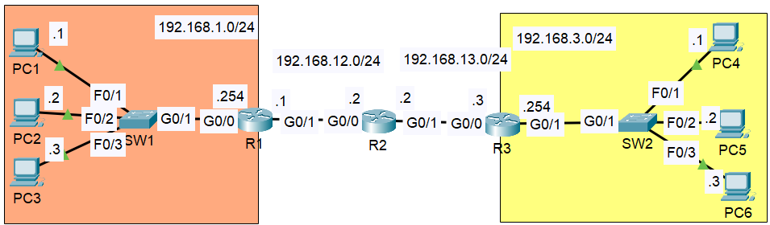

# Day 12 — The Life of a Packet

**Date:** 2026-05-24 | **Module:** Network Fundamentals  
**Source:** Jeremy's IT Lab

> This lab brings together nearly everything covered so far — encapsulation from [Day 01](../TCP_IP%20Model/README.md), MAC address behavior from [Day 09](../Switch%20Interfaces/README.md), the IPv4 header fields from [Day 10](../IPV4%20Header/README.md), and the routing decisions observed in [Day 11](../Static%20Routing/README.md). It is the first lab where all of those concepts appeared together in a single packet journey.

---

## Objective

Trace a packet from source to destination across multiple networks and identify the source and destination MAC addresses at every segment along the path. The goal was to observe — using Packet Tracer's simulation mode and CLI — exactly how the Ethernet frame is rebuilt at each router hop while the IP packet remains unchanged end-to-end.

---

## Topology

**Network summary:**

| Network         | Devices                                           |
| --------------- | ------------------------------------------------- |
| 192.168.1.0/24  | PC1 (.1), PC2 (.2), PC3 (.3), SW1, R1 G0/0 (.254) |
| 192.168.12.0/24 | R1 G0/1 (.1), R2 G0/0 (.2)                        |
| 192.168.13.0/24 | R2 G0/1 (.2), R3 G0/0 (.3)                        |
| 192.168.3.0/24  | R3 G0/1 (.254), SW2, PC4 (.1), PC5 (.2), PC6 (.3) |

---

## Theory

### The Two Addressing Systems Working Together

Every packet in an IP network carries two layers of addressing simultaneously:

- **IP addresses** — Layer 3, written into the IP header. These identify the true source and final destination of the communication. They do not change from the moment the packet leaves the sender to the moment it arrives at the receiver.
- **MAC addresses** — Layer 2, written into the Ethernet frame header. These only identify the devices on the current local segment. Every time a router forwards a packet, it strips the incoming frame completely and builds a brand new one with new source and destination MAC addresses for the next segment.

This is the central idea of this lab. The IP packet is the long-haul instruction — carry this data from A to Z. The Ethernet frame is the short-hop instruction — deliver this to the next device along the way. Every router replaces the short-hop (L2) instruction while leaving the long-haul instruction (L3) completely untouched.

---

### ARP — How MAC Addresses Are Learned Before the Ping

Before the first ICMP echo (ping) can be sent, the sender needs to know the MAC address of the next device it must reach. It does not know this from configuration — it learns it through ARP (Address Resolution Protocol).

The process before PC1 can ping PC4:

1. PC1 checks its routing table. 192.168.3.1 (PC4) is not on the 192.168.1.0/24 network, so PC1 cannot reach it directly. The packet has to go to the default gateway — R1 G0/0 at 192.168.1.254.
2. PC1 checks its ARP table. If R1 G0/0's MAC is not there, PC1 sends an ARP broadcast on the local segment: "Who has 192.168.1.254?"
3. R1 receives the broadcast and replies with its G0/0 MAC address. PC1 stores this in its ARP table.
4. PC1 can now build the Ethernet frame — source MAC is PC1's MAC, destination MAC is R1 G0/0's MAC.
5. The same ARP process repeats at every subsequent router hop, on every segment, for the next-hop MAC address on that segment.

This is why Jeremy's instruction says to ping once before entering simulation mode — the first ping triggers all the ARP exchanges and populates the MAC tables. The simulation then shows clean ICMP traffic without ARP cluttering the view.

---

### What a Router Does With Each Frame

When a frame arrives at a router interface:

1. The router reads the destination MAC in the frame header. If it matches the router's own interface MAC or the broadcast MAC adress(FFFF.FFFF.FFFF), the router accepts the frame.
2. The router strips the entire Ethernet frame header and trailer — the Layer 2 information is discarded.
3. The router reads the destination IP in the IP packet header.
4. The router looks up the destination IP in its routing table and finds the best match (longest prefix match — covered in [Day 11](../Static%20Routing/README.md)).
5. The router determines the exit interface and the next-hop IP.
6. The router ARPs for the next-hop device's MAC if it is not already in its ARP table.
7. The router builds a **completely new Ethernet frame** — new source MAC (its own outgoing interface), new destination MAC (the next-hop device) — and wraps the IP packet inside it.
8. The IP packet inside is untouched. Source and destination IP addresses are exactly as they were when PC1 created them.

---

### The Key Insight — Destination MAC Is Not the Final Destination

Something worth noting from observing the simulation: the destination MAC address in any given frame does not represent where the packet is ultimately going. It represents the next device that needs to handle it. The static route on a router works the same way — it does not guarantee delivery to the final destination, it only specifies the next hop toward it.

The IP packet carries the real destination. Everything at Layer 2 is just a series of handoffs — each one getting the packet one step closer.

---

### TTL Decrement

Each router that processes a packet decrements the TTL field in the IP header by 1. Three routers between PC1 and PC4 means the TTL drops by 3 across the full journey. This was also observed in [Day 11](../Static%20Routing/README.md) where a TTL of 125 confirmed exactly 3 hops. The IPv4 header field behind this was covered in [Day 10](../IPV4%20Header/README.md).

---

### Same-Network Communication — No Router Involved

When PC1 pings PC3, both devices are on the 192.168.1.0/24 network. PC1 recognises this because the network portion of PC3's IP address matches its own. In this case:

- No router is involved at all
- PC1 ARPs directly for PC3's MAC address on the local segment
- The Ethernet frame goes directly from PC1 to PC3 through SW1
- The MAC addresses stay as PC1 and PC3 for the entire journey
- The switch simply forwards the frame based on its MAC address table — it does not change anything in the frame

This is the clearest example of the difference between Layer 2 switching and Layer 3 routing. When the destination is on the same network, Layer 3 is not needed.

---

## Lab

### Exercise 1 — PC1 Pings PC4 (across three routers)

The packet crosses four different networks and three routers. At each router, the Ethernet frame is stripped and rebuilt.

| Segment      | Source MAC | Destination MAC | Note                                                                      |
| ------------ | ---------- | --------------- | ------------------------------------------------------------------------- |
| A. PC1 → SW1 | PC1        | R1 G0/0         | PC1 cannot reach PC4 directly — sends to default gateway                  |
| B. SW1 → R1  | PC1        | R1 G0/0         | SW1 does not modify the frame — just forwards it                          |
| C. R1 → R2   | R1 G0/1    | R2 G0/0         | R1 strips the old frame, builds a new one for the 192.168.12.0/24 segment |
| D. R2 → R3   | R2 G0/1    | R3 G0/0         | R2 does the same — new frame for the 192.168.13.0/24 segment              |
| E. R3 → SW2  | R3 G0/1    | PC4             | R3 knows PC4 is directly connected — ARPs for PC4's MAC                   |
| F. SW2 → PC4 | R3 G0/1    | PC4             | SW2 forwards without modifying — same frame as segment E                  |

Segments A and B carry the same frame. The switch does not alter source or destination MAC — it reads the destination MAC, looks it up in its MAC address table, and forwards the frame out the correct port unchanged.

Segments E and F are also the same frame for the same reason.

---

### Exercise 2 — PC1 Pings PC3 (same network, no router)

PC3 is on the same 192.168.1.0/24 network as PC1. The packet never leaves the local segment.

| Segment      | Source MAC | Destination MAC | Note                                            |
| ------------ | ---------- | --------------- | ----------------------------------------------- |
| A. PC1 → SW1 | PC1        | PC3             | PC1 ARPs for PC3 directly — no gateway involved |
| B. SW1 → PC3 | PC1        | PC3             | SW1 forwards unchanged                          |

The MACs stay as PC1 and PC3 throughout because there is no router hop. This is the simplest possible case — two devices on the same segment communicating directly through a switch.

---

### Exercise 3 — PC4 Pings PC1 (reverse journey)

The return path follows the same logic but in reverse. Each router on the return trip rebuilds the frame for its own outgoing segment.

| Segment      | Source MAC | Destination MAC | Note                                                    |
| ------------ | ---------- | --------------- | ------------------------------------------------------- |
| A. PC4 → SW2 | PC4        | R3 G0/1         | PC4 sends to its default gateway — R3                   |
| B. SW2 → R3  | PC4        | R3 G0/1         | SW2 forwards unchanged                                  |
| C. R3 → R2   | R3 G0/0    | R2 G0/1         | New frame for the 192.168.13.0/24 segment               |
| D. R2 → R1   | R2 G0/0    | R1 G0/1         | New frame for the 192.168.12.0/24 segment               |
| E. R1 → SW1  | R1 G0/0    | PC1             | R1 knows PC1 is directly connected — ARPs for PC1's MAC |
| F. SW1 → PC1 | R1 G0/0    | PC1             | SW1 forwards unchanged                                  |

Comparing Exercise 1 and Exercise 3 side by side makes the symmetry clear. Every segment in the return journey mirrors the forward journey with the source and destination roles swapped.

---

## What I didn't understand

- [ ] STP (Spanning Tree Protocol) — after the ping completed, STP traffic appeared in the simulation. It was unfamiliar and not covered in this video. Need to revisit when switching topics come up.
- [ ] The exact ARP process when a router ARPs on a segment — does it ARP for the next-hop IP or the final destination IP? From observation it appears to be the next-hop, but this needs confirming.

---

## Key Takeaways

- MAC addresses change at every router hop. IP addresses stay the same end-to-end. This is not just a rule to memorise — the simulation made it visually obvious at each step.
- A switch forwards frames without modifying them. This is why segments A and B in Exercise 1 carry identical frames — SW1 is not making any IP decisions, it is just delivering the frame to the right port based on the destination MAC.
- The destination MAC in a frame and the next-hop in a static route serve the same purpose — they point to the next device, not the final destination. The IP packet holds the final destination. Everything at Layer 2 is a series of local handoffs.
- ARP must happen before any IP communication can begin on a new segment. The first ping triggers all the ARP exchanges. Subsequent pings use the cached MAC addresses and are visibly cleaner in simulation mode.
- Same-network communication bypasses the router entirely. PC1 to PC3 never involved R1 at all — the frame went directly through SW1. The moment a destination is on a different network, the default gateway becomes the first destination MAC.
- TTL drops by 1 at each router. Three routers between PC1 and PC4 means three decrements — consistent with what was observed in Day 11 and explained in the IPv4 header fields in Day 10.
