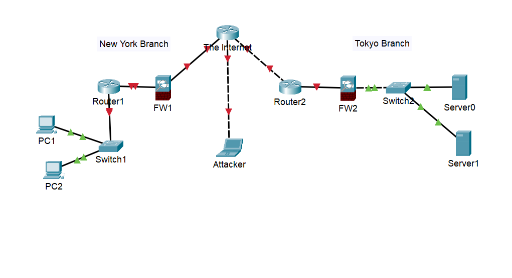

# Day 01 — Basic Network Components

**Date:** 2026-05-09  
**Module:** Network Fundamentals  
**Simulator:** Packet Tracer

---

## 📌 Objective

Introduction with basic network components like - End devices, Switch, Router, Firewall etc. and Connecting two remote branches with basic components.

## 📖 Concepts Covered

- Packet Tracer Simulation.
- Server vs Client
- Routers vs Switch
- Firewalls and its usage.

## 🖧 Topology

