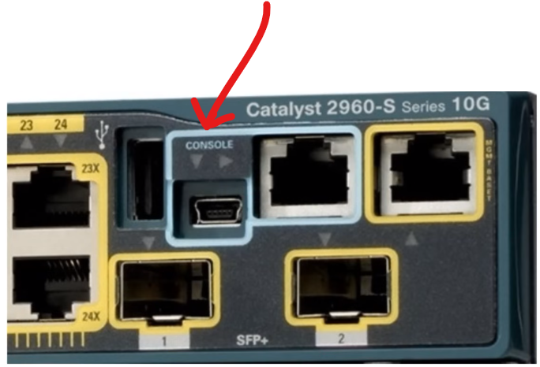

# Intro to CLI & Basic Device Security

**Date:** 2026-05-13 | **Module:** Network Fundamentals | **Simulator:** Packet Tracer

## Objective

To learn the basic commands of CLI and implementing basic security e.g - enable password, enable secret etc.

---

## Theory — CLI and it's different modes

### CLI, Console Port

CLI stands for command line interface, unlike the GUI(Graphics User Interface) in windows the CLI is text based command interface without any fancy graphics. It is text based and sometimes case sensitive.

For configuring Cisco Networking Components like - Routers or Switches, Cisco offers a CLI and an Operating system(Cisco IOS) for each components which can be accessed by connecting the console port with a PC or through remote connections.

The console port can either be connected with a USB - B type cable or an Eathernet cable with a PC.


### Terminal Emulator

After connecting the console port with the PC we need a terminal emulator like PuTTy because most Cisco devices do not have a full graphical interface or built-in screen/keyboard system like a normal PC.

Instead, they expose a CLI through ports such as:

- Console port
- SSH
- Telnet
- AUX port

The terminal emulator sets up a bridge that lets your computer communicate with the Cisco devices as they only have CPU, RAM, Network interfaces, Operating System (IOS) with no monitor, mouse or desktop environment.

```bash
# Cisco CLI Communication Flow

You type command
        ↓
PuTTY captures keystrokes
        ↓
PuTTY packages data using:
    - Serial communication
    - SSH
    - Telnet
        ↓
Data travels to the router/switch
        ↓
Cisco IOS receives the characters
        ↓
IOS interprets the command
        ↓
IOS executes the requested operation
        ↓
IOS sends text output back
        ↓
PuTTY receives the response
        ↓
PuTTY renders the CLI output on screen
```

### Different Exec modes of Cisco CLI

The Cisco Command Line Interface (CLI) uses a hierarchical structure where each mode provides access to a specific set of commands. Transitioning between these modes allows to view status information or modify specific device settings.

There are 3 primary operational modes :

- User Exec Mode
- Privileged Exec Mode
- Global Configuration Mode

Note : _exit_ commnad is used to exit the current Exec mode and move to the lower level of Exec.

#### User Exec Mode

User Exec Mode is the initial "entry-point" when you log in. It is restricted to basic monitoring and viewing system status.
This mode is denoted with ">" sign. _enable_ command is used in this mode to move to the next level (Privileged Exec Mode).

```bash
Router> enable
```

#### Privileged Exec Mode

Also known as Enable Mode, this level provides full access to all device commands and allows to view detailed configurations.
This mode is denoted with "#" sign. _configure terminal or conf t_ command is used in this mode to move to the next level (Global Configuration Mode).

```bash
Router#
```

#### Global Configuration Mode

Used to define settings that apply to the entire device, such as the hostname or routing protocols.
This mode is denoted with "(config)#" sign.

In this mode we can use _enable password_ or the _enable secret_ command for the user to restrict access to Privileged EXEC mode.

**Enable password vs Enable Secret**

Although both commands serve same purpose but the primary difference is security: _enable password_ stores credentials in plain text, whereas _enable secret_ uses strong, non-reversible cryptographic hashing (like MD5 or SHA-256). _Enable secret_ always overrides _enable password_ when both are configured.

Although The _service password-encryption_ command can be used to encrypt plain-text passwords (like enable or line passwords) stored in the running and startup configurations. It uses a weak, proprietary algorithm (Type 7), which is designed to prevent casual "shoulder surfing" but can be easily reversed or decrypted by attackers.

Note: we can use the _do_ command to execute Privileged EXEC mode commands (like show, clear, or debug) while still inside Global Configuration mode or any of its submodes.

**Running Config vs Startup Config**

Cisco IOS has 2 types of config file:

- Running Config
- startup-config

The running-config is the active configuration currently stored in RAM. The startup-config is the saved configuration stored in NVRAM. Changes made to the running-config take effect immediately, but will be lost on reboot unless they are saved to the startup-config.

| Feature         | Running Configuration (`running-config`)                                  | Startup Configuration (`startup-config`)                                     |
| --------------- | ------------------------------------------------------------------------- | ---------------------------------------------------------------------------- |
| Location        | RAM (Random Access Memory)                                                | NVRAM (Non-Volatile RAM)                                                     |
| When it's used  | Actively applies settings and changes while the device is operating       | Loaded into RAM during the device boot-up sequence                           |
| Persistency     | Temporary; disappears if power is lost or the device is rebooted          | Permanent; retains data even without power                                   |
| Purpose         | To execute current network operations and test new configuration commands | To act as the permanent template that tells the router/switch how to boot up |
| View Command    | `show running-config` or `show run`                                       | `show startup-config`                                                        |
| Save Command    | `copy running-config startup-config`                                      | Receives saved data from running-config                                      |
| Erase Command   | Cannot be directly erased separately                                      | `erase startup-config` or `write erase`                                      |
| Reload Behavior | Lost after reload if not saved                                            | Loaded automatically during boot                                             |

```bash
Router(config)# enable password Plain Text password
Router(config)# enable Secret Strong Secret password
Router(config)# service password-encryption
Router(config)# service password-encryption

```
