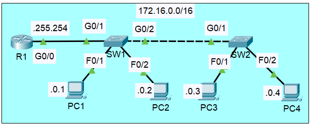

# Switch Interfaces & Interface Configuration

**Date:** 2026-05-24 | **Module:** Network Fundamentals | **Simulator:** Cisco Packet Tracer  
**Source:** Jeremy's IT Lab

---

## Objective

Understand how switch interfaces behave differently from router interfaces, learn the concepts of duplex and speed, explore collision domains and CSMA/CD, and practice configuring individual and ranges of switch interfaces — including speed, duplex, description, and shutdown.

---

## Theory

### Collisions, Hubs, and CSMA/CD

In the early days of Ethernet, devices were connected through **hubs**. A hub is a simple Layer 1 device — it receives a signal on one port and **blindly broadcasts** it out every other port. This means:

- All devices on a hub share the same **collision domain**
- If two devices transmit at the same time, their signals collide and corrupt each other
- Devices had to operate in **half-duplex** mode to manage this

To deal with collisions, Ethernet introduced **CSMA/CD** (Carrier Sense Multiple Access with Collision Detection):

1. **Carrier Sense** — before transmitting, check if the wire is idle
2. **Multiple Access** — all devices share the same medium
3. **Collision Detection** — if a collision happens anyway, all devices stop, wait a random backoff time, and retransmit

#### Switches changed everything

A **switch** is a Layer 2 device. It creates a **separate collision domain per port** — each device connected to a switch port gets dedicated bandwidth and can transmit and receive simultaneously. This means:

- **Full-duplex** is the norm on all switch ports
- CSMA/CD is not needed (though the protocol still exists in the standard)
- No collisions under normal operation

---

### Switch Interfaces vs Router Interfaces — Key Difference

| Behaviour                | Router Interface                                | Switch Interface                                                  |
| ------------------------ | ----------------------------------------------- | ----------------------------------------------------------------- |
| Default state            | **Administratively down** (shutdown by default) | **Up / connected** (no shutdown needed if a device is plugged in) |
| `show interfaces status` | ❌ Not available                                | ✅ Available                                                      |
| Description field label  | `Description:`                                  | Shown as **Name** in `show interfaces status`                     |
| Layer 2 up condition     | Requires `no shutdown`                          | Comes up automatically when a cable is connected                  |

> This is an important distinction. On a router you always need `no shutdown` after configuring an interface. On a switch, the port is already active as soon as a device is connected.

---

### Speed and Duplex — Auto-Negotiation

Switch interfaces support **auto-negotiation** — both ends of a link advertise their capabilities and agree on the best common speed and duplex. This is the default and recommended setting.

You can also configure them manually. But there is an important rule:

> ⚠️ **Duplex mismatch** — if one side is manually set to full-duplex and the other is on auto, the auto side will detect no negotiation partner and **fall back to half-duplex**. This causes a **duplex mismatch**: one side sends freely while the other waits for the line to be idle. The result is excessive collisions and very poor performance, even though the link appears to be "up".

**Best practice:** either set **both sides manually** to the same speed/duplex, or leave **both sides on auto**. Never mix.

---

### Packet Tracer Note

Even when you manually configure speed and duplex on a Packet Tracer switch port, `show interfaces status` may still display `a-full` or `a-100` (the `a-` prefix meaning auto-negotiated). This is a **simulator limitation** — on a real Cisco switch, manually configured ports show without the `a-` prefix.

---

### Interface Error Counters

The `show interfaces` command includes traffic and error statistics. Here are the fields worth knowing:

| Field                            | What it means                                                                                             |
| -------------------------------- | --------------------------------------------------------------------------------------------------------- |
| **Bytes / packets input-output** | Total traffic counters since last clear                                                                   |
| **MTU**                          | Maximum Transmission Unit — largest payload size the interface accepts (1500 bytes for standard Ethernet) |
| **Runts**                        | Frames smaller than 64 bytes — usually caused by collisions or a malfunctioning NIC                       |
| **Giants**                       | Frames larger than the MTU (1500 bytes) — can indicate misconfigured jumbo frames                         |
| **CRC errors**                   | Frame failed the checksum check — usually a bad cable, duplex mismatch, or faulty hardware                |
| **Input errors**                 | Total of all receive-side errors (runts, giants, CRC, etc.)                                               |
| **Output drops**                 | Packets dropped because the output queue was full — sign of congestion                                    |

> Runts and CRC errors appearing together are a classic sign of a **duplex mismatch** or a bad cable — something to watch for when troubleshooting.

---

## 🖧 Lab — Configuring Switch Interfaces

### Topology



---

### Checking interface status before configuration

```
SW1# show interfaces status
```

This gives a cleaner, more readable summary than `show ip int brief` for switches:

| Column     | Meaning                                                                |
| ---------- | ---------------------------------------------------------------------- |
| **Port**   | Interface name                                                         |
| **Name**   | Description (if configured) — this is what routers call `Description:` |
| **Status** | `connected`, `notconnect`, `disabled` (admin shutdown)                 |
| **Vlan**   | VLAN the port belongs to                                               |
| **Duplex** | `a-full` = auto full-duplex / `full` = manually set                    |
| **Speed**  | `a-100` = auto 100Mbps / `100` = manually set                          |
| **Type**   | Media type (e.g. 10/100BaseTX)                                         |

---

### Configuring a single interface


### Configuring a range of interfaces at once

Instead of repeating the same commands on every port, use `interface range`:


> You can also specify non-contiguous ports: `interface range fa0/1, fa0/3, fa0/5`

Disabling unused ports is a **security best practice** — it prevents unauthorized devices from plugging in and getting network access.
---

### Verifying after configuration

```
SW1# show interfaces status
SW1# show interfaces fastEthernet 0/1
SW1# show running-config
```


---

### Save the configuration

```
SW1# copy running-config startup-config
```

---

## Commands Reference

| Command                              | Where            | What it does                                                      |
| ------------------------------------ | ---------------- | ----------------------------------------------------------------- |
| `show interfaces status`             | Privileged exec  | Switch-only: shows port name, status, VLAN, duplex, speed, type   |
| `show interfaces`                    | Privileged exec  | Detailed stats for all interfaces — errors, counters, duplex, MAC |
| `show interfaces fa0/1`              | Privileged exec  | Same detail for one specific interface                            |
| `show running-config`                | Privileged exec  | View active configuration in RAM                                  |
| `interface fa0/1`                    | Global config    | Enter config mode for a single interface                          |
| `interface range fa0/5 - 12`         | Global config    | Enter config mode for a range of interfaces simultaneously        |
| `description <text>`                 | Interface config | Adds a label — shown as "Name" in `show interfaces status`        |
| `speed <10/100/1000/auto>`           | Interface config | Manually set interface speed or restore auto-negotiation          |
| `duplex <half/full/auto>`            | Interface config | Manually set duplex mode or restore auto-negotiation              |
| `shutdown`                           | Interface config | Administratively disables the interface                           |
| `no shutdown`                        | Interface config | Re-enables a disabled interface                                   |
| `copy running-config startup-config` | Privileged exec  | Saves config to NVRAM                                             |

---

## What I didn't fully understand

- [ ] Why Packet Tracer still shows `a-full` even when manually configured — need to test on a real IOS image
- [ ] When exactly CRC errors appear in practice — want to simulate a duplex mismatch to see it
- [ ] VLAN column in `show interfaces status` — all ports show VLAN 1 by default, haven't covered VLANs yet

---

## Key Takeaways

- **Switch ports are up by default** — no `no shutdown` needed if a cable is connected. This is the opposite of router interfaces.
- **Duplex mismatch is dangerous** — the link will appear up but performance will be terrible. Always set both ends to auto or both ends to manual.
- `show interfaces status` is a **switch-only command** — it doesn't exist on routers. It's the cleanest way to see port state, speed, duplex, and VLAN at a glance.
- Use `interface range` to configure multiple ports at once — essential for disabling unused ports cleanly.
- **Runts + CRC errors** appearing together = likely duplex mismatch or bad cable. Flag for troubleshooting.
