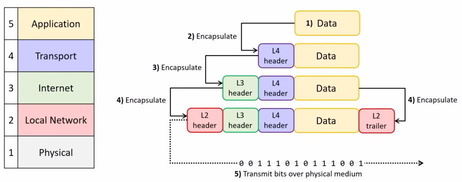
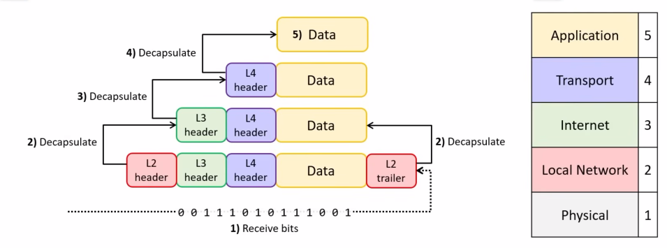
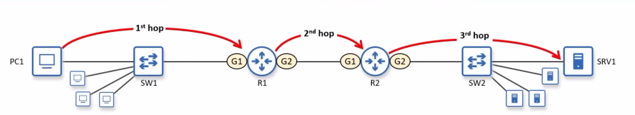
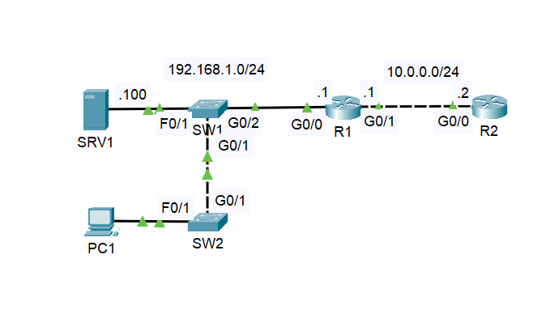

# TCP/IP Model, Encapsulation & Decapsulation

**Date:** 2026-05-12 | **Module:** Network Fundamentals | **Simulator:** Packet Tracer

## Objective

Understand how data is encapsulated layer by layer in the TCP/IP model and observe each layer's PDU
by capturing a DHCP release/renew exchange from a PC to a DHCP server.

---

## Theory — TCP/IP Model & Encapsulation

### The TCP/IP Layers

TCP stands for Transmission Control Protocol and IP stands for Internet Protocol. The TCP/IP model is named after its two most crucial protocols.

| Layer | Name                  | PDU Name                       | Example Protocols                    |
| ----- | --------------------- | ------------------------------ | ------------------------------------ |
| 5     | Application           | Data                           | HTTP, DNS, DHCP, FTP                 |
| 4     | Transport             | Segment (TCP) / Datagram (UDP) | TCP, UDP                             |
| 3     | Network (Internet)    | Packet                         | IP, ICMP                             |
| 2     | Network Access (Link) | Frame                          | Ethernet(802.3), Wi-Fi(802.11)       |
| 1     | Physical              | Bits                           | Copper Cables, Optic or Radio Signal |

> Note: PDU = Protocol Data Unit — the name given to data at each specific layer.

### What is a Protocol?

A protocol is a **set of rules** that defines how two devices at the same layer communicate.

- Protocols define: message format, what actions to take, order of messages
- Examples per layer:
  - Application → DHCP defines how a client requests an IP address
  - Transport → UDP defines connectionless delivery (used by DHCP)
  - Network → IP defines addressing and routing
  - Network Access → Ethernet defines MAC addressing and framing

### Encapsulation (Sending side — going DOWN the layers)

Each layer takes the data from the layer above and **wraps it with its own header** (and sometimes a trailer).

- The process of adding headers going down is called **encapsulation**
- The final product that goes onto the wire are **bits**



### Decapsulation (Receiving side — going UP the layers)

The receiving device strips each header as data moves up the stack.

- Network Access layer reads & removes the Ethernet header/trailer → passes Packet up
- Network layer reads & removes the IP header → passes Segment up
- Transport layer reads & removes TCP/UDP header → passes Data up
- Application layer reads the raw data

  

### Adjacent Layer Interaction

This is communication **between two different layers on the same device**.

- Each layer provides a **service** to the layer above it
- Each layer uses the **service** of the layer below it
- Example: the Transport layer hands a Segment down to the Network layer, which wraps it into a Packet

> Think of it as a chain of service: every layer is both a customer (to the layer below) and a provider (to the layer above).

### Same Layer Interaction

This is the **logical communication between the same layer on two different devices**.

- The Transport layer on PC1 "talks to" the Transport layer on the server — even though physically data passes through all layers
- This is possible because each layer adds its own header which only the matching layer on the other side actually reads and processes
- Example: PC1's IP layer sets the source/destination IP → the server's IP layer reads those fields

> Same layer interaction is what makes **protocols** work — the rules two peers at the same layer agree on.

---

### What is a Hop?

A **hop** is each router (or L3 device) a packet passes through on its way to the destination. Switches are not counted as hops because it only forwards frames inside a Local Network.

- At every hop, the Network Access layer header is **stripped and rebuilt** with new source/destination MAC addresses
- The IP header (Network layer) stays the same end-to-end — only MACs change hop-to-hop
- This is why IP addresses identify endpoints, while MAC addresses only matter per-segment



---

## 🖧 Lab — Observing each layer's PDUs with DHCP Release/Renew commands

### Topology



### Lab Goal

Used `ipconfig /release` and `ipconfig /renew` on a PC and observe the PDU details at each layer
in Packet Tracer's simulation mode.

<!-- ### Why DHCP for this lab?

DHCP uses **UDP** at the Transport layer (not TCP), which makes it a clean example because:

- You see a connectionless exchange (no handshake overhead)
- The broadcast nature shows how Network Access layer addressing works before an IP is assigned -->

### What I observed

| Layer          | PDU seen                                        | Header fields visible                        |
| -------------- | ----------------------------------------------- | -------------------------------------------- |
| Application    | DHCP message (DISCOVER / OFFER / REQUEST / ACK) | Message type, Client MAC                     |
| Transport      | UDP Datagram                                    | Src port 68, Dst port 67                     |
| Network        | IP Packet                                       | Src 0.0.0.0, Dst 255.255.255.255 (broadcast) |
| Network Access | Ethernet Frame                                  | Src MAC (PC), Dst MAC FF:FF:FF:FF:FF:FF      |

> DHCP DISCOVER uses 0.0.0.0 as source IP because the PC doesn't have one yet — the IP layer still
> exists, it just uses a placeholder. This is a great example of same-layer interaction even before
> a real address is assigned.

### Commands used

```bash
PC> ipconfig /release
PC> ipconfig /renew
```

---

## What I didn't fully understand

- [ ] Why DHCP uses UDP instead of TCP — need to revisit connectionless vs connection-oriented
- [ ] Exactly how the Ethernet trailer (FCS) works and what it checks
- [ ] The full 4-step DHCP DORA process — only partially visible in this lab

---

## Key Takeaways

- TCP/IP Model is not a Law, its a Standard to make communication Vendor neutral.
- TCP/IP has 5 layers; each layer adds its own header going down (encapsulation) and strips it going up (decapsulation)
- PDU names change per layer: Data → Segment/Datagram → Packet → Frame → Bits
- **Adjacent layer interaction** = one device, two neighboring layers talking to each other
- **Same layer interaction** = two devices, same layer communicating via a shared protocol
- MAC addresses change at every hop; IP addresses stay constant end-to-end
