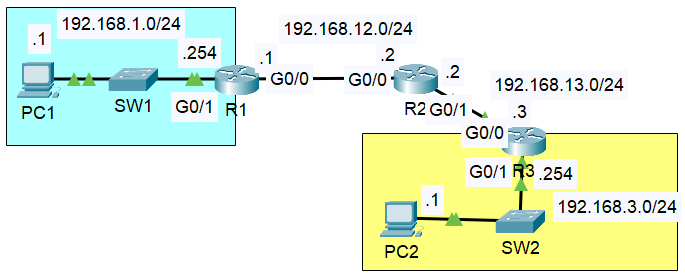

# Day 11 — Routing Fundamentals & Static Routing

**Date:** 2026-05-24 | **Module:** Network Fundamentals | **Simulator:** Cisco Packet Tracer  
**Source:** Jeremy's IT Lab

> See [troubleshooting.md](./troubleshooting.md) for the follow-up lab — diagnosing broken static routes on this same topology.

---

## Objective

This lab was about understanding how routers decide where to send packets, reading a routing table for the first time, and manually configuring static routes across three routers so PC1 and PC2 could communicate.

---

## Theory

### What is Routing?

Routing is how a router decides where to forward a packet. When a packet arrives on an interface, the router checks the destination IP against its routing table and sends the packet out the interface that best matches. Unlike a switch, it does not flood — it makes a deliberate forwarding decision every time.

---

### The Routing Table

The routing table is the router's map of known networks. Every entry tells the router: "to reach this network, go this way." You read it with:

```
R1# show ip route
```


The codes at the top of the output tell you how each route was learned. The ones that matter right now:

| Code | Meaning                 | How it gets into the table                                                    |
| ---- | ----------------------- | ----------------------------------------------------------------------------- |
| C    | Connected               | Added automatically when an interface is configured with an IP and brought up |
| L    | Local                   | Also added automatically — the router's own interface IP, shown as a /32      |
| S    | Static                  | Manually configured by an admin                                               |
| \*   | Default route candidate | The fallback route when nothing else matches — "gateway of last resort"       |

R, O, B, and the others will show up once dynamic routing protocols are covered. For now these three are the ones to focus on.

---

### Connected (C) vs Local (L) — A Confusing Part

This was one of the things that needed a second look. When an interface comes up, the router adds two routes automatically for the same network — a C and an L. They look almost identical at first glance:

```
C    192.168.1.0/24 is directly connected, GigabitEthernet0/1
L    192.168.1.254/32 is directly connected, GigabitEthernet0/1
```

The difference is in what they are used for:

| Route         | Prefix                         | Purpose                                                                                          |
| ------------- | ------------------------------ | ------------------------------------------------------------------------------------------------ |
| C (Connected) | /24 — the full subnet          | Used for packets going to other devices on that network — router forwards them out the interface |
| L (Local)     | /32 — just the router's own IP | Used for packets addressed to the router itself — the router keeps and processes these locally   |

So a packet to 192.168.1.1 (PC1) matches the C route and gets forwarded out. A packet to 192.168.1.254 (the router's own IP) matches the L route — the router treats it as addressed to itself.

---

### Longest Prefix Match — The Core Decision Rule

When a packet matches more than one route in the table, the router picks the most specific one — the route with the longest prefix length. This is called the longest prefix match.

```
192.168.1.0/24   — matches 256 addresses
192.168.1.254/32 — matches exactly 1 address
```

A packet destined for 192.168.1.254 matches both, but /32 wins because it is more specific. This rule runs on every forwarding decision the router makes.

| Route            | Prefix | Addresses covered                                   |
| ---------------- | ------ | --------------------------------------------------- |
| 0.0.0.0/0        | /0     | Every address — least specific, used as last resort |
| 192.168.1.0/24   | /24    | 256 addresses                                       |
| 192.168.1.254/32 | /32    | Exactly 1 — most specific                           |

---

### The Default Route

The default route is `0.0.0.0/0`. It matches every possible destination because /0 means no bits of the address need to match. It only gets used when nothing more specific exists in the table — which is why it is called the gateway of last resort.

```
R1(config)# ip route 0.0.0.0 0.0.0.0 <next-hop-ip>
```

In the routing table it shows as:

```
S*   0.0.0.0/0 [1/0] via <next-hop>
```

The `*` is what marks it as the default. In this lab, no default route was configured — every network was explicitly routed — so the output shows `Gateway of last resort is not set`.

---

### Static Routes

A static route is a manually added entry that tells the router how to reach a network it is not directly connected to.

```
ip route <destination-network> <subnet-mask> <next-hop-ip>
```

Or using the exit interface instead of a next-hop IP:

```
ip route <destination-network> <subnet-mask> <exit-interface>
```

Static routes do not update on their own. If the topology changes, the routes have to be updated manually. That makes them simple and predictable, which is why they are a good starting point before learning dynamic protocols.

The `[1/0]` that appears next to a static route in the table means Administrative Distance 1, Metric 0. AD of 1 means the router trusts static routes highly — only directly connected routes at AD 0 rank above them.

---

## Lab — Configuring Static Routes

### Topology



### Network Addressing

| Device | Interface | IP Address    | Subnet Mask   | Network         |
| ------ | --------- | ------------- | ------------- | --------------- |
| PC1    | NIC       | 192.168.1.1   | 255.255.255.0 | 192.168.1.0/24  |
| R1     | G0/1      | 192.168.1.254 | 255.255.255.0 | 192.168.1.0/24  |
| R1     | G0/0      | 192.168.12.1  | 255.255.255.0 | 192.168.12.0/24 |
| R2     | G0/0      | 192.168.12.2  | 255.255.255.0 | 192.168.12.0/24 |
| R2     | G0/1      | 192.168.13.2  | 255.255.255.0 | 192.168.13.0/24 |
| R3     | G0/0      | 192.168.13.3  | 255.255.255.0 | 192.168.13.0/24 |
| R3     | G0/1      | 192.168.3.254 | 255.255.255.0 | 192.168.3.0/24  |
| PC2    | NIC       | 192.168.3.1   | 255.255.255.0 | 192.168.3.0/24  |

Default gateways: PC1 points to 192.168.1.254 (R1 G0/1), PC2 points to 192.168.3.254 (R3 G0/1).

---

### Step 1 — Configure hostnames and interface IPs

Each router started with no configuration. Hostname first, then each interface. Shown here for R1:

```
Router(config)# hostname R1

R1(config)# interface g0/1
R1(config-if)# ip address 192.168.1.254 255.255.255.0
R1(config-if)# no shutdown

R1(config)# interface g0/0
R1(config-if)# ip address 192.168.12.1 255.255.255.0
R1(config-if)# no shutdown
```

---

### Step 2 — Plan the static routes before configuring

After the interfaces are up, each router automatically knows its own directly connected networks through C and L routes. But nothing beyond that. The table below shows what each router is missing and needs a static route for:

| Router | Knows automatically              | Missing — needs static route      |
| ------ | -------------------------------- | --------------------------------- |
| R1     | 192.168.1.0/24, 192.168.12.0/24  | 192.168.3.0/24 (PC2's network)    |
| R2     | 192.168.12.0/24, 192.168.13.0/24 | 192.168.1.0/24 and 192.168.3.0/24 |
| R3     | 192.168.13.0/24, 192.168.3.0/24  | 192.168.1.0/24 (PC1's network)    |

An easy mistake here is only configuring routes in one direction. The ping request needs a path forward and the reply needs a path back. If R3 has no route to 192.168.1.0/24, PC2 receives the ping but cannot reply — and the ping still fails.

---

### Step 3 — Configure the static routes

R1 — needs a route to PC2's network via R2:

```
R1(config)# ip route 192.168.3.0 255.255.255.0 192.168.12.2
```

R2 — sits in the middle, needs routes in both directions:

```
R2(config)# ip route 192.168.1.0 255.255.255.0 192.168.12.1
R2(config)# ip route 192.168.3.0 255.255.255.0 192.168.13.3
```

R3 — needs a route back to PC1's network via R2:

```
R3(config)# ip route 192.168.1.0 255.255.255.0 192.168.13.2
```

---

### Step 4 — Verify the routing tables

Running `show ip route` on each router to confirm the S entries appeared correctly.

**R1:**


R1 has C and L entries for its own networks and one S entry for 192.168.3.0/24 pointing via 192.168.12.2. Gateway of last resort is not set — expected.

**R2:**


R2 has two S entries — one back toward PC1's network via R1, one forward toward PC2's network via R3. Both needed for traffic to flow in both directions.

**R3:**


R3 has one S entry pointing to 192.168.1.0/24 via R2. Combined with its directly connected 192.168.3.0/24, it can now reach both ends.

---

### Step 5 — Test connectivity

```
PC1> ping 192.168.3.1
```


4 out of 4 replies, 0% packet loss, TTL 125.

The TTL of 125 makes sense — Windows starts ICMP packets at TTL 128 and each router hop decrements it by 1. Three routers between PC1 and PC2 means 128 minus 3 equals 125. Reading TTL is a quick way to count how many hops a packet crossed.

---

## Commands Reference

| Command                               | Where           | What it does                                                       |
| ------------------------------------- | --------------- | ------------------------------------------------------------------ |
| `show ip route`                       | Privileged exec | Displays the full routing table — all routes, codes, and next-hops |
| `ip route <net> <mask> <next-hop>`    | Global config   | Adds a static route via a next-hop IP                              |
| `ip route <net> <mask> <interface>`   | Global config   | Adds a static route via an exit interface                          |
| `ip route 0.0.0.0 0.0.0.0 <next-hop>` | Global config   | Configures the default route                                       |
| `no ip route <net> <mask> <next-hop>` | Global config   | Removes a static route                                             |
| `show ip interface brief`             | Privileged exec | Quick summary of interface IPs and status                          |
| `copy running-config startup-config`  | Privileged exec | Saves configuration to NVRAM                                       |

---

## What I didn't fully understand

- [ ] Administrative Distance [1/0] — what exactly AD means and what happens when two routes to the same destination have the same AD
- [ ] What happens to a packet when no route matches and there is no default route — does it drop silently?
- [ ] Proxy ARP — mentioned when a static route is configured using an exit interface instead of a next-hop IP, need to revisit this

---

## Key Takeaways

- A router only knows its directly connected networks automatically. Everything beyond that needs either a static route or a routing protocol.
- Longest prefix match is the core forwarding rule — the most specific matching route always wins, regardless of how it was learned.
- C and L routes for the same interface look similar but do different things. C forwards traffic to other hosts on the network. L catches traffic addressed to the router itself.
- Static routing requires thinking in both directions. The request needs a path and so does the reply.
- TTL starts at 128 on Windows and drops by 1 at each router hop. A TTL of 125 in the ping reply confirmed three hops — R1, R2, R3 — exactly as expected from the topology.
- The default route 0.0.0.0/0 is the last resort. It only matches when nothing more specific exists.
