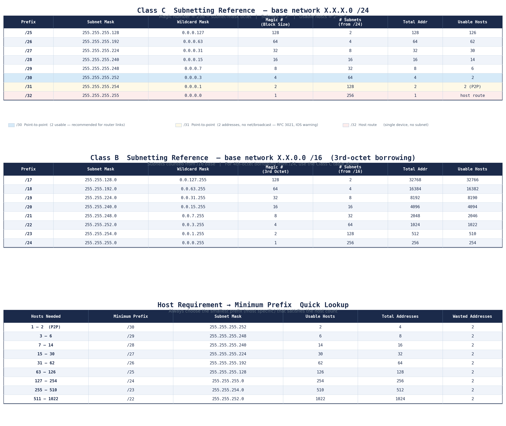
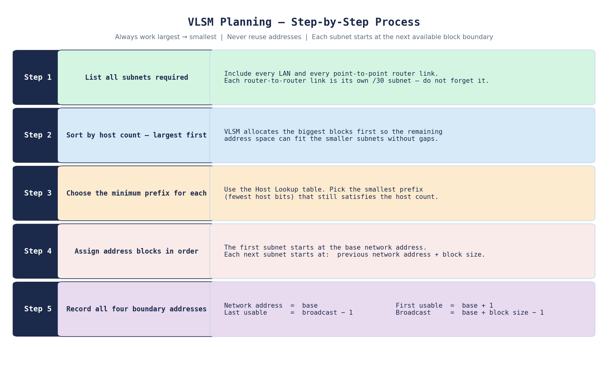

# Days 13–15 — Subnetting & VLSM

**Module:** Network Fundamentals  
**Source:** Jeremy's IT Lab — Days 13, 14, 15

> The lab for this topic is in [lab.md](./lab.md) — VLSM applied to a real four-LAN topology with static routing.  
> IPv4 address classes introduced in [Day 07–08](../IPV4%20Adresses/README.md) are the foundation this builds on.

---

## Objective

Understand why classful addressing wasted IPv4 address space, how subnetting reclaims that space by borrowing host bits, and how VLSM extends that further by allowing different prefix lengths within the same classful block — fitting each subnet exactly to its host requirement.

---

## The Problem With Classful Addressing

In the classful model, every network address belongs to a fixed class with a preset prefix — /8 for Class A, /16 for Class B, /24 for Class C. There is no flexibility.

The waste this creates is severe in practice. A company that needs 10 host addresses on a network is forced into a Class C /24 — which provides 254 usable addresses. 244 of those addresses are permanently unusable by anyone else. Scale this across millions of networks and the IPv4 address space runs out fast. Also, these wasted adresses raise security concerns.

| Class | Fixed Prefix | Usable Hosts | Problem                                                        |
| ----- | ------------ | ------------ | -------------------------------------------------------------- |
| A     | /8           | 16,777,214   | Enormous waste for anything smaller than a continental network |
| B     | /16          | 65,534       | Still far too large for most organisations                     |
| C     | /24          | 254          | Reasonable, but rigid — no smaller allocation possible         |

---

## The Solution — Classless Addressing and Subnetting

Classless addressing removes the fixed prefix constraint. Any prefix length from /0 to /32 is valid. The prefix is always written explicitly — either in dotted decimal (255.255.255.192) or as a slash notation (/26) — because there is no longer a default to assume.

Subnetting is the mechanism that makes this work. Starting from a classful block, host bits are borrowed and repurposed as network bits. Each borrowed bit doubles the number of available subnets and halves the number of hosts per subnet.

---

### How Borrowing Works

Starting from a Class C /24 (8 host bits available):

```
Original /24:  11000000.10101000.00000001 | 00000000
                         network bits (24) | host bits (8)

Borrow 1 bit:  11000000.10101000.00000001.0 | 0000000   → /25
Borrow 2 bits: 11000000.10101000.00000001.00 | 000000   → /26
Borrow 3 bits: 11000000.10101000.00000001.000 | 00000   → /27
```

Each borrowed bit:

- Adds one bit to the network portion (prefix length grows by 1)
- Removes one bit from the host portion
- Doubles the number of subnets
- Halves the total addresses per subnet

---

### The Formulas

```
Number of subnets   =  2ⁿ       where n = number of borrowed bits
Addresses per subnet=  2ʰ       where h = remaining host bits
Usable hosts        =  2ʰ − 2   subtract network address and broadcast
```

The −2 accounts for two reserved addresses in every subnet:

- **Network address** — all host bits set to 0 (identifies the subnet itself)
- **Broadcast address** — all host bits set to 1 (sends to all hosts in the subnet)

Neither can be assigned to a device.

---

### The Magic Number

The magic number (also called the block size) is the increment between consecutive subnet network addresses. It is calculated from the subnet mask of the interesting octet:

```
Magic number = 256 − subnet mask value in the relevant octet
```

For a /26 mask (255.255.255.192): 256 − 192 = **64**

The four /26 subnets carved from 192.168.1.0/24 would be:

- 192.168.1.**0**/26
- 192.168.1.**64**/26
- 192.168.1.**128**/26
- 192.168.1.**192**/26

Each starts exactly 64 addresses after the previous one. The magic number makes it possible to find all subnet boundaries without binary arithmetic.

---

## Subnetting Reference Tables



The table covers three things in one reference:

- **Class C** subnetting — prefix lengths /25 through /32, with mask, wildcard, magic number, subnet count, and usable hosts
- **Class B** subnetting — prefix lengths /17 through /24, working in the third octet
- **Host requirement lookup** — given a host count, find the minimum prefix that satisfies it

The /30, /31, and /32 rows are colour-coded because they behave differently from standard subnets — covered below.

---

### The /30 — Point-to-Point Standard

A /30 gives exactly 4 addresses: one network address, two usable hosts, one broadcast. This makes it the standard choice for the link between two routers — one IP per router interface, no waste.

```
192.168.5.224/30
Network:    192.168.5.224
R1 G0/0/0:  192.168.5.225
R2 G0/0/0:  192.168.5.226
Broadcast:  192.168.5.227
```

---

### The /31 — Point-to-Point Exception

A /31 gives 2 addresses with no network or broadcast. RFC 3021 permits this for point-to-point links specifically because both addresses are reachable without a broadcast. Cisco IOS accepts it but prints a warning — the same warning observed in the [Day 11 troubleshooting lab](../Static%20Routing/troubleshooting.md) when a static route was configured using an exit interface.

---

### The /32 — Host Route

A /32 matches exactly one address. It is not a subnet in the traditional sense — it is used as a host route to identify a single device, commonly seen in loopback interface addresses and in certain routing protocol configurations.

---

### Subnets Are Separate Networks

Every subnet created by this process is its own independent network. Devices in different subnets cannot communicate with each other directly — they require a router or a Layer 3 switch to forward packets between them. A switch alone will not cross subnet boundaries regardless of how the ports are configured.

This also means that classful boundaries are just a starting point. In a classless mindset, 192.168.5.0/24 is itself a subnet of 192.168.5.0/23, which is a subnet of 192.168.4.0/22, and so on. Every prefix is a subnet of a less-specific containing block.

---

## VLSM — Variable Length Subnet Masking

Standard subnetting gives every subnet the same prefix length — which means the same number of host addresses. If a network needs one subnet for 60 hosts and another for 10, both get the same /26 (62 usable) even though the second wastes 52 addresses.

VLSM solves this by allowing different prefix lengths within the same classful block. Each subnet gets exactly the prefix it needs — no more.



---

### The Key Rule — Largest to Smallest

VLSM allocation must always proceed from the largest host requirement to the smallest. The reason is mathematical: large blocks must be aligned to their own boundaries, and those boundaries only exist at specific addresses. Allocating small subnets first can consume addresses that a large subnet would need to start at a valid boundary.

Specifically: a subnet with block size B must start at an address that is a multiple of B. A /25 (block size 128) can only start at .0 or .128 within a /24. If smaller subnets have already consumed those addresses, the /25 cannot be placed.

---

### Next Available Address

After each subnet is allocated, the next subnet begins at:

```
next network address = current network address + block size
```

This is mechanical once the block size is known. There are no gaps and no overlaps as long as allocations stay in order.

---

## What I didn't fully understand

- [ ] Why /31 is still not universally used despite RFC 3021 — some older devices do not support it. Need to understand which scenarios it is safe to use.

---

## Key Takeaways

- Classful addressing assigns a fixed prefix per class regardless of actual need — this wastes enormous amounts of address space.
- The formulas are: subnets = 2ⁿ and usable hosts = 2ʰ − 2. The −2 is always for the network address and broadcast address.
- The magic number = 256 − the subnet mask value in the relevant octet. It gives the block size and makes subnet boundary calculation straightforward without binary conversion.
- All subnets are separate networks. Communication between subnets requires a router or Layer 3 switch.
- VLSM extends subnetting by allowing variable prefix lengths within the same block. Always allocate largest to smallest to avoid boundary alignment problems.
- The /30 is the standard for point-to-point router links. The /31 is a valid alternative under RFC 3021 but Cisco IOS raises a warning when it is configured.
