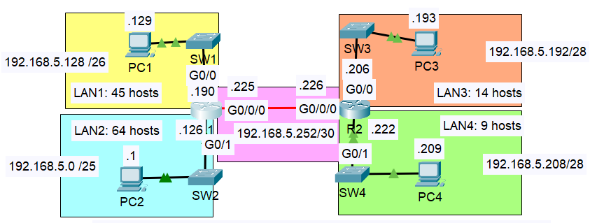

# Days 13–15 — VLSM Lab

**Module:** Network Fundamentals | **Simulator:** Cisco Packet Tracer  
**Source:** Jeremy's IT Lab

> This lab applies the VLSM concepts from [README.md](./README.md) to a real four-LAN topology. The static routing configured here follows the same process from [Day 11](../Static%20Routing/README.md).

---

## Objective

Subnet the 192.168.5.0/24 address space using VLSM to provide the right number of addresses for each LAN and the point-to-point link between R1 and R2. Assign the first usable address to each PC and the last usable address to each router interface. Configure static routes so all PCs can ping each other.

---

## Topology



---

## Step 1 — List All Subnets and Sort by Host Count

Before touching any addresses, every subnet requirement is listed and sorted largest to smallest. The point-to-point link between R1 and R2 counts as a subnet.

| #   | Subnet     | Hosts Required | Notes                          |
| --- | ---------- | -------------- | ------------------------------ |
| 1   | LAN2       | 64             | Largest — allocate first       |
| 2   | LAN1       | 45             |                                |
| 3   | LAN3       | 14             |                                |
| 4   | LAN4       | 9              |                                |
| 5   | R1–R2 link | 2              | Point-to-point — allocate last |

---

## Step 2 — Choose the Minimum Prefix for Each

Using the host lookup table from [README.md](./README.md):

| Subnet | Hosts Required | Minimum Prefix | Usable Hosts | Block Size |
| ------ | -------------- | -------------- | ------------ | ---------- |
| LAN2   | 64             | /25            | 126          | 128        |
| LAN1   | 45             | /26            | 62           | 64         |
| LAN3   | 14             | /28            | 14           | 16         |
| LAN4   | 9              | /28            | 14           | 16         |
| R1–R2  | 2              | /30            | 2            | 4          |

LAN3 and LAN4 both fit a /28 — 14 usable hosts satisfies both requirements exactly at the boundary, which is fine.

---

## Step 3 — Assign Address Blocks

Starting at 192.168.5.0 and adding the block size after each allocation:

**LAN2 — /25 (block size 128)**

|                       | Address       |
| --------------------- | ------------- |
| Network               | 192.168.5.0   |
| First usable → PC2    | 192.168.5.1   |
| Last usable → R1 G0/1 | 192.168.5.126 |
| Broadcast             | 192.168.5.127 |

**LAN1 — /26 (block size 64)**  
Next block starts at 192.168.5.0 + 128 = **192.168.5.128**

|                       | Address       |
| --------------------- | ------------- |
| Network               | 192.168.5.128 |
| First usable → PC1    | 192.168.5.129 |
| Last usable → R1 G0/0 | 192.168.5.190 |
| Broadcast             | 192.168.5.191 |

**LAN3 — /28 (block size 16)**  
Next block starts at 192.168.5.128 + 64 = **192.168.5.192**

|                       | Address       |
| --------------------- | ------------- |
| Network               | 192.168.5.192 |
| First usable → PC3    | 192.168.5.193 |
| Last usable → R2 G0/0 | 192.168.5.206 |
| Broadcast             | 192.168.5.207 |

**LAN4 — /28 (block size 16)**  
Next block starts at 192.168.5.192 + 16 = **192.168.5.208**

|                       | Address       |
| --------------------- | ------------- |
| Network               | 192.168.5.208 |
| First usable → PC4    | 192.168.5.209 |
| Last usable → R2 G0/1 | 192.168.5.222 |
| Broadcast             | 192.168.5.223 |

**R1–R2 link — /30 (block size 4)**  
Next block starts at 192.168.5.208 + 16 = **192.168.5.224**

|                          | Address       |
| ------------------------ | ------------- |
| Network                  | 192.168.5.224 |
| First usable → R1 G0/0/0 | 192.168.5.225 |
| Last usable → R2 G0/0/0  | 192.168.5.226 |
| Broadcast                | 192.168.5.227 |

The entire 192.168.5.0/24 block has been used efficiently. Only 28 addresses remain unused at the top of the range — compared to hundreds that would be wasted with equal-length subnetting.

---

## Step 4 — Full Address Assignment Summary

| Device | Interface | IP Address    | Prefix | Default Gateway |
| ------ | --------- | ------------- | ------ | --------------- |
| PC1    | NIC       | 192.168.5.129 | /26    | 192.168.5.190   |
| PC2    | NIC       | 192.168.5.1   | /25    | 192.168.5.126   |
| PC3    | NIC       | 192.168.5.193 | /28    | 192.168.5.206   |
| PC4    | NIC       | 192.168.5.209 | /28    | 192.168.5.222   |
| R1     | G0/0      | 192.168.5.190 | /26    | —               |
| R1     | G0/1      | 192.168.5.126 | /25    | —               |
| R1     | G0/0/0    | 192.168.5.225 | /30    | —               |
| R2     | G0/0      | 192.168.5.206 | /28    | —               |
| R2     | G0/1      | 192.168.5.222 | /28    | —               |
| R2     | G0/0/0    | 192.168.5.226 | /30    | —               |

---

## Step 5 — Configure Interfaces

R1:

```
R1(config)# interface g0/1
R1(config-if)# ip address 192.168.5.126 255.255.255.128
R1(config-if)# no shutdown

R1(config)# interface g0/0
R1(config-if)# ip address 192.168.5.190 255.255.255.192
R1(config-if)# no shutdown

R1(config)# interface g0/0/0
R1(config-if)# ip address 192.168.5.225 255.255.255.252
R1(config-if)# no shutdown
```

R2:

```
R2(config)# interface g0/0
R2(config-if)# ip address 192.168.5.206 255.255.255.240
R2(config-if)# no shutdown

R2(config)# interface g0/1
R2(config-if)# ip address 192.168.5.222 255.255.255.240
R2(config-if)# no shutdown

R2(config)# interface g0/0/0
R2(config-if)# ip address 192.168.5.226 255.255.255.252
R2(config-if)# no shutdown
```

---

## Step 6 — Configure Static Routes

Each router needs static routes for every network it is not directly connected to.

**R1** — directly knows LAN1, LAN2, and the R1–R2 link. Needs routes to LAN3 and LAN4 via R2:

```
R1(config)# ip route 192.168.5.192 255.255.255.240 192.168.5.226
R1(config)# ip route 192.168.5.208 255.255.255.240 192.168.5.226
```

**R2** — directly knows LAN3, LAN4, and the R1–R2 link. Needs routes to LAN1 and LAN2 via R1:

```
R2(config)# ip route 192.168.5.0 255.255.255.128 192.168.5.225
R2(config)# ip route 192.168.5.128 255.255.255.192 192.168.5.225
```

---

## Step 7 — Verify Routing Tables

**R1 routing table:**


R1 shows C and L entries for its three directly connected networks (LAN1 /26, LAN2 /25, and the /30 link) plus two S entries for LAN3 and LAN4 via 192.168.5.226. The header line confirms variably subnetted — 8 subnets, 5 masks — which is the expected output when multiple different prefix lengths exist within the same classful block.

**R2 routing table:**


R2 shows its directly connected LAN3, LAN4, and the /30 link, plus two S entries pointing to LAN1 and LAN2 via 192.168.5.225.

---

## Step 8 — Verify Connectivity

**PC2 to PC3:**


**PC2 to PC4:**


Both pings return 4 out of 4 replies with TTL 126. TTL of 126 confirms exactly 2 router hops — PC2 through R1, then through R2 to reach PC3 or PC4. This is consistent with what was established in [Day 10](../IPV4%20Header/README.md) and observed in [Day 11](../Static%20Routing/README.md).

---

## What I didn't fully understand

- [ ] The `variably subnetted, 8 subnets, 5 masks` line in the routing table — understand what it means (multiple prefix lengths within the same /24) but want to confirm exactly how IOS counts the masks.

---

## Key Takeaways

- VLSM planning is entirely done on paper before any configuration. Getting the prefix choices and block boundaries right first means the configuration is just typing in numbers.
- The largest-to-smallest ordering is not optional — it prevents boundary alignment failures that would make certain prefix lengths impossible to place.
- The point-to-point link is easy to forget because it is not a LAN. Every router-to-router connection needs its own subnet.
- TTL in the ping replies provides a quick sanity check on the path length. Two hops from PC2 to PC3 and PC4 matched the topology exactly.
