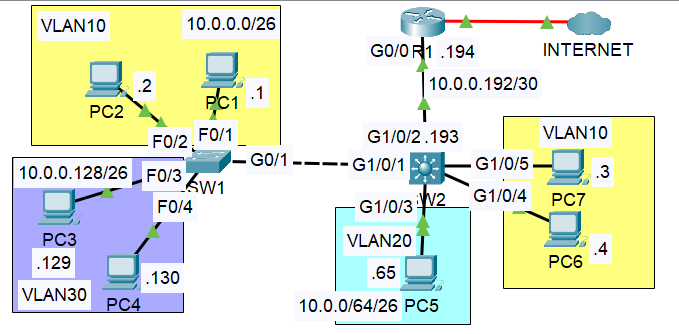

# VLANs — Part 3: Multilayer Switch & SVI Inter-VLAN Routing

**Module:** Network Fundamentals | **Simulator:** Cisco Packet Tracer  
**Source:** Jeremy's IT Lab — VLAN Part 3

> This builds directly on [Part 2](<../../VLANs/Router%20On%20a%20Stick%20(ROAS)/Readme.md>). The same topology is used, but SW2 is replaced with a multilayer switch. The external router is removed from inter-VLAN routing entirely and the switch takes over that job through SVIs.

---

## Objective

Replace the ROAS configuration from Part 2 with a multilayer switch doing inter-VLAN routing internally through SVIs. Keep R1 in the picture only for the internet connection, using a simple point-to-point Layer 3 link between the switch and the router.

---

## Theory

### What is a Multilayer Switch

A multilayer switch (also called a Layer 3 switch) can do everything a regular Layer 2 switch does — forwarding frames based on MAC addresses — but it also has Layer 3 routing capability built in. It can route packets between VLANs internally without any traffic ever leaving the switch to reach an external router.

This is both faster and more scalable than ROAS. In ROAS, every inter-VLAN packet physically travels out of the switch, up to the router, and back down — even if source and destination are in different VLANs on the same switch. A multilayer switch handles that routing internally, which eliminates the extra trip entirely.

### SVI — Switched Virtual Interface

An SVI is a virtual Layer 3 interface that represents a VLAN on a multilayer switch. It is configured with an IP address that becomes the default gateway for all hosts in that VLAN — exactly the role R1's subinterfaces played in Part 2, but now hosted on the switch itself.

Each SVI is tied to a VLAN number. When a host in VLAN 10 wants to reach a host in VLAN 30, the packet goes to its default gateway (the VLAN 10 SVI), the switch routes it internally to the VLAN 30 SVI, and delivers it to the destination. No external router involved.

For an SVI to come up, two conditions must be met simultaneously:

- The VLAN must exist on the SWITCH
- The SWITCH must have at least ONE access port in the VLAN in an “up/up” state AND/OR one TRUNK port that allows the VLAN that is in an “up/up” state
- The VLAN must not be shutdown (“shutdown” command can be used to disable a VLAN)
- The SVI must not be shutdown (SVIs are disabled, by default)

If either condition is missing, the SVI stays down even if it has an IP configured. This became relevant during the lab — a newly created SVI won't come up on a switch with no active port in that VLAN.

### Native VLAN — Configuration Methods

Part 2 set the native VLAN using `switchport trunk native vlan` on the switch interface. The same thing can be done on the router side by adding the `native` keyword to the encapsulation command on a subinterface:

```
encapsulation dot1Q <vlan-id> native
```

This tells the router to treat that VLAN's traffic as untagged on the trunk. Both approaches produce the same result — the choice depends on which side is more convenient to configure.

Another way of setting Native VLAN on router is to set the Native VLAN ip address on the main interface of the subinterfaces


### Routed Port on a Multilayer Switch

By default, every port on a switch is a switchport — it operates at Layer 2. To use a port as a point-to-point Layer 3 link (like the connection to R1 in this lab), it needs to be converted to a routed port with `no switchport`. Once that command runs, the port loses its VLAN awareness entirely and behaves exactly like a router interface — it can hold an IP address and participate in routing decisions.

### `ip routing`

A multilayer switch has routing hardware but routing is disabled by default. The single command `ip routing` turns it on globally, enabling the switch to make Layer 3 forwarding decisions. Without it, SVIs can have IP addresses but the switch will not route between them.

---

## Lab

### Topology



SW2 is now a multilayer switch. R1 connects to SW2 through a /30 point-to-point link (10.0.0.192/30) and handles only the internet connection. SW2 handles all inter-VLAN routing internally.

---

### Step 1 — Remove ROAS from R1

The subinterfaces from Part 2 were deleted one by one, then the physical interface was reset to defaults using `default interface`:


`default interface` resets the interface to factory state — removing any IP, encapsulation, and mode settings that had been applied. Then G0/0 was reconfigured as a plain routed interface with the point-to-point IP:

```
R1(config)# interface g0/0
R1(config-if)# ip address 10.0.0.194 255.255.255.252
R1(config-if)# no shutdown
```

---

### Step 2 — Configure the Routed Port and Default Route on SW2

First, `ip routing` was enabled to turn on Layer 3 forwarding. Then the default route was added pointing to R1 for any traffic heading to the internet. Then G1/0/2 was converted from a switchport to a routed port and given the other end of the /30:


The moment `no switchport` ran, IOS logged the line protocol going down and then up — the port was being re-initialised as a routed interface. This is expected.

The default route points to R1's G0/0 at 10.0.0.194. Every packet that doesn't match a local route — anything headed to the internet — follows this path out to R1.

---

### Step 3 — Configure SVIs on SW2

One SVI per VLAN, each holding the last usable address of that subnet — the same gateway IPs used in Parts 1 and 2.


Each SVI came up immediately after `no shutdown` because the VLANs already existed in the database and active ports were already assigned. IOS confirmed each one with a line protocol up message. If the VLAN hadn't existed or had no active ports, those messages wouldn't appear — the SVI would silently stay down.

---

### Step 4 — Test Inter-VLAN Connectivity


4/4 replies, TTL 127 — one hop, same as Parts 1 and 2. The hop is now internal to SW2 rather than a round trip to an external router, but the TTL result looks identical from the PC's perspective.

---

### Step 5 — Test Internet Connectivity


4/4 replies, TTL 253. Starting from Cisco's default of 255, two hops were decremented — SW2 routing the packet out to R1, then R1 forwarding it to the internet router. That matches the path in the topology exactly.

---

## Commands Reference

| Command                               | Where            | What it does                                                        |
| ------------------------------------- | ---------------- | ------------------------------------------------------------------- |
| `ip routing`                          | Global config    | Enables Layer 3 routing on a multilayer switch                      |
| `no switchport`                       | Interface config | Converts a switch port to a routed Layer 3 port                     |
| `interface vlan <id>`                 | Global config    | Creates or enters an SVI for a specific VLAN                        |
| `default interface <int>`             | Global config    | Resets an interface to factory defaults — removes all configuration |
| `no interface <subint>`               | Global config    | Deletes a subinterface entirely                                     |
| `ip route 0.0.0.0 0.0.0.0 <next-hop>` | Global config    | Default route — sends unmatched traffic toward the internet gateway |

---

## What I didn't fully understand

- [ ] Whether `ip routing` persists after a reload or needs to be re-entered — need to check if it's saved with the running config.
- [ ] How routing between SVIs compares in performance to ROAS on real hardware — Packet Tracer doesn't model the difference, but the concept of internal routing being faster makes intuitive sense.

---

## Key Takeaways

A multilayer switch replaces the external router for inter-VLAN routing entirely. SVIs give each VLAN a Layer 3 gateway address on the switch itself, and with `ip routing` enabled, the switch forwards packets between VLANs internally — no external trip needed. The external router stays in the picture only for internet access, connected through a simple routed point-to-point link. `no switchport` is what converts a regular switch port into that routed link. And two conditions have to be true before an SVI will come up: the VLAN must exist in the database, and at least one active port must be assigned to it.
