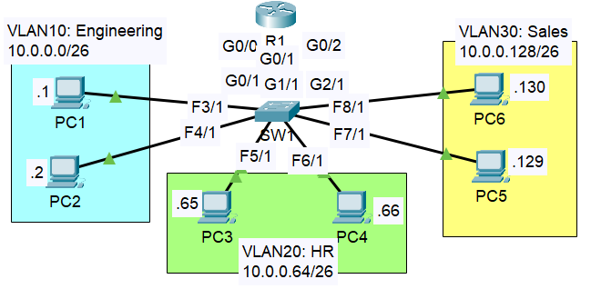

# VLANs — Part 1: Basics, Access Ports & Inter-VLAN Routing (Separate Links)

**Module:** Network Fundamentals | **Simulator:** Cisco Packet Tracer  
**Source:** Jeremy's IT Lab — VLAN Part 1

> Part 2 covers the same inter-VLAN routing problem solved here but using a single trunk link and router subinterfaces instead of a dedicated physical connection per VLAN — [Part 2: Router-on-a-Stick](../Part_2_InterVLAN_Router_on_Stick/README.md).

---

## Objective

Understand what VLANs are, why they exist, and how to configure them on a Cisco switch. Configure three VLANs across a single switch, assign the correct ports to each VLAN, and use separate physical links to a router to enable inter-VLAN communication.

---

## Theory

### LAN and Broadcast Domain

A LAN (Local Area Network) is a network contained within a relatively small area — typically a single building or floor. Devices on the same LAN communicate at Layer 2 using MAC addresses.

A broadcast domain is the set of devices that receive a broadcast frame sent by any one of them. When a device sends a Layer 2 broadcast (destination MAC `FF:FF:FF:FF:FF:FF`), every device in the same broadcast domain receives it. Routers do not forward broadcasts — they are the natural boundary of a broadcast domain. Switches, by default, forward broadcasts out every port.

---

### The Problem — One Big Broadcast Domain

Without VLANs, every device connected to a switch is in the same broadcast domain regardless of which IP subnet it belongs to. This is the part that is easy to miss: **IP subnets and broadcast domains are not the same thing**.

A switch is a Layer 2 device. It does not read IP addresses when forwarding frames. If PC1 is on 10.0.0.1/26 and PC3 is on 10.0.0.65/26 and both are connected to the same switch with no VLAN configuration, they are in the same broadcast domain. A broadcast from PC1 reaches PC3 even though they are on completely different subnets.

This creates two real problems as a network grows:

- **Security** — an ARP broadcast from the Engineering department reaches every device in Sales and HR. Traffic that should be isolated is visible to everyone.
- **Performance** — every device must process every broadcast, even ones completely irrelevant to it. A large flat network generates constant background broadcast noise that consumes CPU on every connected device.

---

### VLANs — Logical Separation at Layer 2

A VLAN (Virtual Local Area Network) is a logical grouping of switch ports that acts as its own independent broadcast domain. Frames sent within VLAN 10 stay within VLAN 10. They never reach ports assigned to VLAN 20 or VLAN 30, regardless of physical proximity.

VLANs exist entirely in software. A single physical switch can host multiple VLANs, each one isolated from the others at Layer 2. This makes it possible to separate the Engineering, HR, and Sales departments onto the same physical switch without their broadcast traffic ever mixing.

Key advantages:

- Broadcast traffic is contained within each VLAN — smaller broadcast domains, less noise
- Departments are logically separated without requiring separate physical switches
- Security improves because Layer 2 isolation means a device in one VLAN cannot receive frames from another VLAN through normal switching
- Grouping is logical, not physical — a device can be moved to a different department just by reassigning its switch port to a different VLAN

---

### Default VLANs

When a Cisco switch ships from the factory, VLAN 1 already exists and every port is assigned to it by default. This is the default VLAN. It cannot be deleted or renamed.

VLANs 1002 to 1005 also exist by default — these are legacy VLANs for older network types (FDDI, Token Ring) that are no longer used in modern networks. They appear in `show vlan brief` but can be ignored in practice.

Any VLAN created manually is assigned a number from 2 to 1001 (the normal VLAN range). The extended range is 1006 to 4094 and requires different configuration — not relevant at this stage.

---

### Access Ports

A switch port operates in one of two modes. An **access port** carries traffic for exactly one VLAN. The VLAN assignment is invisible to the connected device — PC1 does not know it is in VLAN 10. The switch handles the VLAN logic internally.

Access ports are used wherever an end device connects — PCs, printers, servers, and in this lab, the router interfaces. Each router interface is treated as an end device on its VLAN.

The other mode — a trunk port — carries multiple VLANs on one physical link and becomes relevant in Part 2.

---

### Inter-VLAN Routing — One Physical Link Per VLAN

Devices in different VLANs cannot communicate with each other at Layer 2 — that is the whole point of the separation. To route between VLANs, a Layer 3 device is required.

The simplest approach is one physical cable per VLAN between the switch and a router. Each router interface is configured with the gateway IP for its VLAN and assigned to that VLAN as an access port on the switch side. The router's routing table naturally connects the subnets because each interface is directly connected to one of them.

This works, but does not scale. Three VLANs require three physical links and three router interfaces. A network with 20 VLANs would need 20 router interfaces — impractical on any real hardware. Part 2 introduces router-on-a-stick, which collapses all inter-VLAN traffic onto a single trunk link.

---

## Lab — Configuring Three VLANs with Separate Router Links

### Topology



Three VLANs are carved from the 10.0.0.0/8 address space using /26 subnets — six PCs distributed across Engineering, HR, and Sales. R1 connects to SW1 with three separate Gigabit links, one per VLAN.

---

### IP Addressing

The gateway for each subnet is the last usable address — consistent with the convention used since [Day 07–08](../../Day_07_08_IPv4_Addressing/README.md).

| Device  | VLAN             | IP Address | Subnet Mask     | Gateway    |
| ------- | ---------------- | ---------- | --------------- | ---------- |
| PC1     | 10 — Engineering | 10.0.0.1   | 255.255.255.192 | 10.0.0.62  |
| PC2     | 10 — Engineering | 10.0.0.2   | 255.255.255.192 | 10.0.0.62  |
| PC3     | 20 — HR          | 10.0.0.65  | 255.255.255.192 | 10.0.0.126 |
| PC4     | 20 — HR          | 10.0.0.66  | 255.255.255.192 | 10.0.0.126 |
| PC5     | 30 — Sales       | 10.0.0.129 | 255.255.255.192 | 10.0.0.190 |
| PC6     | 30 — Sales       | 10.0.0.130 | 255.255.255.192 | 10.0.0.190 |
| R1 G0/0 | 10 — Engineering | 10.0.0.62  | 255.255.255.192 | —          |
| R1 G0/1 | 20 — HR          | 10.0.0.126 | 255.255.255.192 | —          |
| R1 G0/2 | 30 — Sales       | 10.0.0.190 | 255.255.255.192 | —          |

---

### Port Assignments on SW1

| SW1 Port | Connected To | VLAN |
| -------- | ------------ | ---- |
| Fa3/1    | PC1          | 10   |
| Fa4/1    | PC2          | 10   |
| Gig0/1   | R1 G0/0      | 10   |
| Fa5/1    | PC3          | 20   |
| Fa6/1    | PC4          | 20   |
| Gig1/1   | R1 G0/1      | 20   |
| Fa7/1    | PC5          | 30   |
| Fa8/1    | PC6          | 30   |
| Gig2/1   | R1 G0/2      | 30   |

---

### Step 1 — Create VLANs and Name Them on SW1

VLANs must be created before ports can be assigned to them. Entering `vlan <id>` in global config creates the VLAN if it does not exist and opens VLAN config mode where a name can be assigned.

```
SW1(config)# vlan 10
SW1(config-vlan)# name Engineering

SW1(config)# vlan 20
SW1(config-vlan)# name HR

SW1(config)# vlan 30
SW1(config-vlan)# name Sales
```

---

### Step 2 — Assign Ports to VLANs on SW1

Each port connected to a PC or to a router interface is set as an access port and assigned to the correct VLAN. Shown here for VLAN 10 — the same pattern repeats for VLANs 20 and 30.

```
SW1(config)# interface range fa3/1, fa4/1, gig0/1
SW1(config-if-range)# switchport mode access
SW1(config-if-range)# switchport access vlan 10

```

The router-facing port (Gig0/1) is assigned to VLAN 10 as an access port, the same as the PC ports. From the switch's perspective, R1's interface is just another end device on that VLAN.

Using `interface range` speeds this up when multiple ports share the same VLAN:

```
SW1(config)# interface range fa3/1, fa4/1, gig0/1
SW1(config-if-range)# switchport mode access
SW1(config-if-range)# switchport access vlan 10
```

---

### Step 3 — Configure R1 Interfaces

Each router interface receives the gateway IP for its VLAN. No VLAN configuration is needed on R1 — the VLAN logic is entirely handled by the switch.

```
R1(config)# interface g0/0
R1(config-if)# ip address 10.0.0.62 255.255.255.192
R1(config-if)# no shutdown

R1(config)# interface g0/1
R1(config-if)# ip address 10.0.0.126 255.255.255.192
R1(config-if)# no shutdown

R1(config)# interface g0/2
R1(config-if)# ip address 10.0.0.190 255.255.255.192
R1(config-if)# no shutdown
```

---

### Step 4 — Verify VLAN Configuration

```
SW1# show vlan brief
```


VLANs 10, 20, and 30 are active with the correct names and port assignments. The default VLANs 1002–1005 appear automatically and can be ignored. VLAN 1 still shows Fa9/1 — a port left in its default state, which is worth noting as a security consideration. Unused ports should either be shut down or explicitly assigned to an unused VLAN.

---

### Step 5 — Verify R1's Routing Table

```
R1# show ip route
```


R1 shows three directly connected /26 networks — one per interface, one per VLAN. No static routes were needed here because R1's directly connected routes are sufficient to reach all three subnets. Any packet arriving from one VLAN is matched against R1's routing table and forwarded out the correct interface toward the destination VLAN.

The `variably subnetted, 6 subnets, 2 masks` line confirms that all three /26 subnets come from the same 10.0.0.0/8 classful block — the same pattern seen in the [VLSM lab](../../Subnetting/lab.md).

---

### Step 6 — Test Inter-VLAN Connectivity

**PC1 (Engineering) to PC3 (HR):**


**PC4 (HR) to PC6 (Sales):**


**PC5 (Sales) to PC1 (Engineering):**


All three cross-VLAN pings return 4/4 replies with TTL 127. TTL of 127 confirms exactly one router hop — PC traffic exits the source VLAN, passes through R1, and arrives at the destination VLAN. This is consistent with the TTL behaviour observed in [Day 11](../../Static%20Routing/README.md) and explained in the IPv4 header field notes in [Day 10](../../IPV4%20Header/README.md).

---

### Step 7 — Broadcast Observation in Simulation Mode

Sending a broadcast ping from PC1 (destination 10.0.0.63 — the VLAN 10 broadcast address) and observing in simulation mode confirmed that only PC2 and R1's G0/0 interface received the broadcast. PC3 through PC6 received nothing.

This is the VLAN working as intended. The switch does not forward the broadcast out ports belonging to VLAN 20 or VLAN 30 — the broadcast domain ends at the VLAN boundary.

---

## Commands Reference

| Command                       | Where            | What it does                                             |
| ----------------------------- | ---------------- | -------------------------------------------------------- |
| `vlan <id>`                   | Global config    | Creates a VLAN and enters VLAN config mode               |
| `name <name>`                 | VLAN config      | Assigns a human-readable name to the VLAN                |
| `switchport mode access`      | Interface config | Sets the port as an access port — carries one VLAN only  |
| `switchport access vlan <id>` | Interface config | Assigns the access port to a specific VLAN               |
| `interface range <ports>`     | Global config    | Enters config mode for multiple ports simultaneously     |
| `show vlan brief`             | Privileged exec  | Lists all VLANs, their names, status, and assigned ports |
| `show vlan`                   | Privileged exec  | Full VLAN detail including port types                    |
| `do show vlan brief`          | Any config mode  | Runs a show command without leaving config mode          |

---

## What I didn't fully understand

- [ ] Why VLAN 1 is considered a security risk and what best practice looks like for unused ports — leaving them in VLAN 1 feels wrong but the alternative was not covered yet
- [ ] What happens at Layer 2 if a port is not explicitly assigned to a VLAN — does it stay in VLAN 1 permanently or does it depend on the switch model?

---

## Key Takeaways

- A broadcast domain and an IP subnet are not the same thing. Without VLANs, devices on different subnets can still share a broadcast domain if they are on the same switch — the switch does not read IP addresses when forwarding frames.
- VLANs create logical separation at Layer 2. Broadcast traffic in VLAN 10 never reaches ports in VLAN 20 or VLAN 30, regardless of physical connections.
- Every port on a Cisco switch belongs to VLAN 1 by default. Ports must be explicitly assigned to a different VLAN with `switchport access vlan`.
- The router-facing ports are configured as access ports on the switch side — the switch treats R1's interface exactly like a PC. R1 itself needs no VLAN awareness in this design.
- Inter-VLAN traffic always goes through a Layer 3 device. The TTL of 127 in the ping replies confirmed one hop through R1 for every cross-VLAN ping.
- One physical link per VLAN works but does not scale. Three VLANs consumed three router interfaces and three switch ports just for uplinks — Part 2 solves this with a single trunk link.
